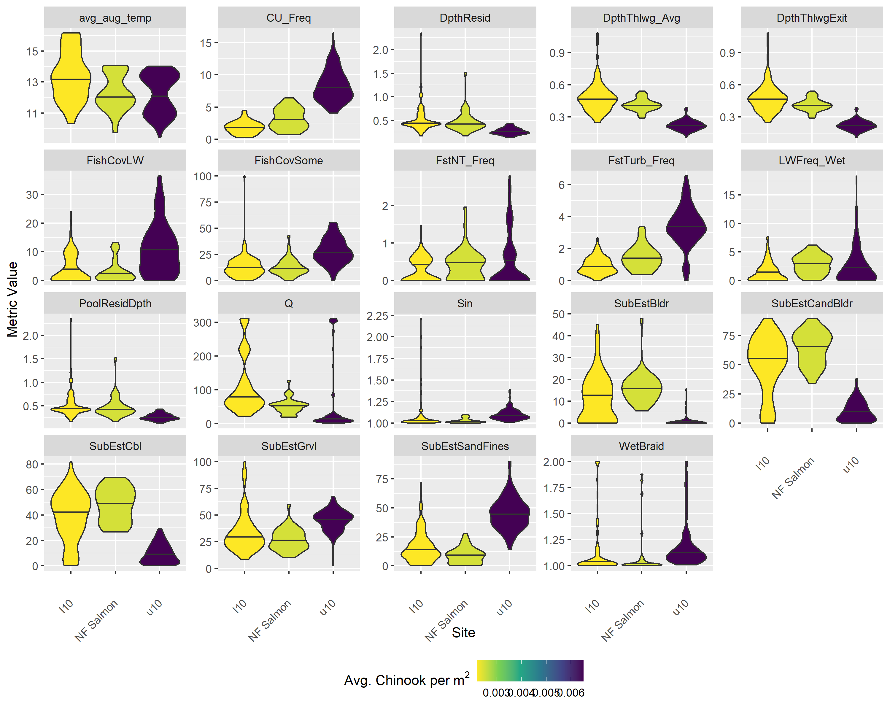

<!-- the following inserts MHE logo into header -->

```{=html}
<script>
   $(document).ready(function() {
     $head = $('#header');
     $head.prepend('')
   });
</script>
```
```{r setup, echo = FALSE, message = FALSE}
knitr::opts_chunk$set(
  collapse = TRUE,
  warning = FALSE,
  message = FALSE,
  echo = FALSE,
  comment = "#>",
  fig.path = "../figures/",
  dpi = 600
)

options(knitr.kable.NA = '--')

```

```{r load-libraries}
# run this if running chunks directly

# for formatting
library(kableExtra)
library(ggpubr)

# for analysis
library(sf)
library(here)
library(tidyverse)
library(magrittr)
library(ggmap)
library(nngeo)
library(janitor)
library(ggspatial)
library(ggrepel)

theme_set(theme_pubr(x.text.angle = 45,
                     base_size = 8))

```

# Background

The primary purpose of a North Fork Salmon River Assessment is to develop a restoration plan that provides a strategy for informing the identification, prioritization, and development of high-quality projects to improve instream habitats for salmonids listed under the Endangered Species Act (ESA) and other aquatic species. The assessment is intended to identify habitat limitations and associated geomorphically appropriate restoration recommendations for spawning and rearing life-stages of Chinook salmon and steelhead along reaches of the North Fork Salmon River and tributaries encompassing approximately 85 km of stream.

Rio ASE and Mount Hood Environmental (MHE) personnel have developed a framework for completing this assessment. Analyses will be conducted to facilitate the understanding of expected riverine and floodplain processes and the identification of restoration actions that are consistent and compatible with natural reach-scale hydraulic categories, types, and locations of potential restoration actions relative to distinct geomorphic reaches within the watershed. The North Fork Salmon River assessment consists of integrated biological (e.g., fish habitat) and geomorphic analyses to identify restoration actions that are physically appropriate and optimized to improve instream habitats of ESA-listed salmonids and other aquatic species. This approach will provide the basis for linking project identification, development, implementation, monitoring, and adaptive management at the same spatial scales to effectively plan project development and implementation strategies.

## Focal Species

The focal species for this fish habitat assessment are:

-   Snake River spring/summer-run Chinook salmon (*Oncorhynchus tshawytscha*; hereafter Chinook salmon; ESA-listed threatened)
-   Snake River summer-run steelhead (*O. mykiss*; hereafter steelhead; ESA-listed threatened)

We assume that actions taken to improve habitat conditions for Chinook salmon and steelhead in the North Fork Salmon River would likely also benefit other salmonids, including:

-   bull trout (*Salvelinus confluentus*; ESA-listed threatened)
-   westslope cutthroat trout (*O. clarkii lewisi*)

## General Approach

A key component for the biological approach is to assess the watershed (population) habitat carrying capacity necessary to support recovery of Chinook salmon and steelhead and compare that to available habitat capacity to elucidate watershed-scale capacity limitations in the North Fork Salmon River. Information on capacity deficits (available habitat carrying capacity relative to habitat carrying capacity necessary to achieve population level recovery goals), by species and life-stage (spawning, summer rearing, and winter rearing), can inform geomorphic assessments to identify geomorphically appropriate solutions to resolve limitations, assisting project identification, development, and implementation. Estimates of the capacity necessary to achieve given recovery goals are accomplished using a Generalized Capacity Model (GCM;[Appendix C in @IdahoOSCTeam2019]). Available habitat capacity estimates are made using a quantile random forest (QRF) framework [@See2021].

The watershed-scale fish habitat capacity assessment is supplemented by a summer stream temperature assessment to identify life-stages or locations where temperature may be limiting growth or survival of Chinook salmon and steelhead in the North Fork Salmon River. The stream temperature assessment leverages data available from NorWeST [@Isaak2017a].

Next, we provide a reach-scale assessment of fish-habitat conditions in the North Fork Salmon River, by species and life-stage, using fish habitat surveys completed in the North Fork Salmon River in 2020 and 2021 and using the Drone-Assisted Stream Habitat [DASH - @Carmichael2019] protocol.

# Watershed Assessment

## Habitat Carrying Capacity

Habitat capacity deficits (e.g., Figure \@ref(fig:capacity-schematic)) resulting from limitations in habitat quantity and/or quality were calculated for three life-stages of Chinook salmon and steelhead: 1) spawning (redds), 2) juvenile summer rearing, and 3) juvenile winter rearing. First, the capacity required to meet adult abundance escapement goals was estimated for each of the three life-stages using a GCM framework [see Appendix C in @IdahoOSCTeam2019]. Then, currently available habitat capacity was estimated using the QRF framework described in @See2021 applied at each life-stage. Finally, capacity limitations were identified by subtracting required capacity from available capacity, providing an estimate of (potential) habitat capacity deficits by species and life-stage.

```{r capacity-schematic, out.width = "100%", fig.cap = "Schematic depicting habitat capacity by life-stage, with an ideal scenario on the left with no limiting factors, while the right depicts a river with significant limiting factors resulting in reduced habitat capacity and production."}
knitr::include_graphics("../figures/hab-capac-fig.png")

```

```{r load-data, results = 'hide'}
# NF Salmon QRF extrapolations
load(here("analysis/data/derived_data/NF_qrf_extrapolations.rda"))

# Project area polygons and 200m layer (with habitat attributes) within project area
load(here("analysis/data/derived_data/NF_spatial.rda"))

# Species domains for the NF salmon manually modified in QGIS with expert knowledge from Jessica Buelow - IDFG
NF_crs = st_crs(4326) # WGS84

NF_sp_domain_sf = st_read(here("analysis/data/raw_data/NF_sp_Domain.gpkg"), quiet = TRUE) %>%
  st_transform(NF_crs)

NF_sp_domain_df = NF_sp_domain_sf %>%
  st_drop_geometry() %>%
  as_tibble()

NF_HUC12_sf = st_read(here("analysis/data/raw_data/watershed_boundary/HUC12/NFSR_HUC12.shp"), quiet = TRUE) %>%
  st_transform(NF_crs)

NF_geo_reach_sf = st_read(here("analysis/data/raw_data/Reaches_delineation/Reaches.shp"), quiet = TRUE) %>%
  st_transform(NF_crs)

# append correct domains & geomorph reach designations
NF_sum_sf = NF_sum_sf %>%
  rename(chnk_strmnt = chnk,
         sthd_strmnt = sthd) %>%
  left_join(., NF_sp_domain_df %>%
              select(c("chnk", "sthd","UniqueID"))) 

NF_win_sf = NF_win_sf %>%
  rename(chnk_strmnt = chnk,
         sthd_strmnt = sthd) %>%
  left_join(., NF_sp_domain_df %>%
              select(c("chnk","sthd","UniqueID")))

NF_redd_sf = NF_redd_sf %>%
  rename(chnk_strmnt = chnk,
         sthd_strmnt = sthd) %>%
  left_join(., NF_sp_domain_df %>%
              select(c("chnk","sthd","UniqueID")))

# convert sf objects to tibbles
NF_sum_df = NF_sum_sf %>%
  st_drop_geometry() %>%
  as_tibble()

NF_win_df = NF_win_sf %>%
  st_drop_geometry() %>%
  as_tibble()

NF_redd_df = NF_redd_sf %>%
  st_drop_geometry() %>%
  as_tibble()

```

### Required Capacity

```{r get-params}
params = read_csv(here("../GCM_General/data/LifeHistoryParameters.csv"))

#define target escapement
target.esc = c(625, 625) # Chinook, steelhead; MAT + 25%
n.sim = 5000

set.seed(352)
#Simulate the required abundances by life-stage

#With normal distribution - no stoch for egg:parr, parr:presmolt
reqs = tibble(Sim_number = rep(1:n.sim,2),
              Species = c(rep("Chinook",n.sim),rep("Steelhead",n.sim)),
              Escapement = c(rep(target.esc[1],n.sim), rep(target.esc[2],n.sim)),
              f_ratio = c(rnorm(n.sim, params$Value[1],params$SD[1]),
                          rnorm(n.sim, params$Value[7],params$SD[7])),
              redds_f = c(rnorm(n.sim, params$Value[2],params$SD[2]),
                          rnorm(n.sim, params$Value[8],params$SD[8])),
              fecund = c(rnorm(n.sim, params$Value[3],params$SD[3]),
                          rnorm(n.sim, params$Value[9],params$SD[9])),
              egg_to_parr = c(rep(params$Value[4],n.sim),
                          rep(params$Value[10],n.sim)),
              parr_to_presmolt = c(rep(params$Value[5],n.sim),
                          rep(params$Value[11],n.sim)),
              egg_to_smolt = c(rep(params$Value[6],n.sim),
                               rep(params$Value[12],n.sim))) %>%
  mutate(f_ratio = ifelse(f_ratio < params$Min[1] & Species == "Chinook", params$Min[1],
                          ifelse(f_ratio > params$Max[1] & Species == "Chinook", params$Max[1],
                                 ifelse(f_ratio < params$Min[7] & Species == "Steelhead", params$Min[7],
                                        ifelse(f_ratio > params$Max[7] & Species == "Steelhead", params$Max[7], f_ratio)))),
         redds_f = ifelse(redds_f < params$Min[2] & Species == "Chinook", params$Min[2],
                          ifelse(redds_f > params$Max[2] & Species == "Chinook", params$Max[2],
                                 ifelse(redds_f < params$Min[8] & Species == "Steelhead", params$Min[8],
                                        ifelse(redds_f > params$Max[8] & Species == "Steelhead", params$Max[8], redds_f)))),
         fecund = ifelse(fecund < params$Min[3] & Species == "Chinook", params$Min[3],
                          ifelse(fecund > params$Max[3] & Species == "Chinook", params$Max[3],
                                 ifelse(fecund < params$Min[9] & Species == "Steelhead", params$Min[9],
                                        ifelse(fecund > params$Max[9] & Species == "Steelhead", params$Max[9], fecund)))),
         # egg_to_parr = ifelse(egg_to_parr < params$Min[4] & Species == "Chinook", params$Min[4],
         #                  ifelse(egg_to_parr > params$Max[4] & Species == "Chinook", params$Max[4],
         #                         ifelse(egg_to_parr < params$Min[9] & Species == "Steelhead", params$Min[9],
         #                                ifelse(egg_to_parr > params$Max[9] & Species == "Steelhead", params$Max[9], egg_to_parr)))),
         # parr_to_presmolt = ifelse(parr_to_presmolt < params$Min[5] & Species == "Chinook", params$Min[5],
         #                  ifelse(parr_to_presmolt > params$Max[5] & Species == "Chinook", params$Max[5],
         #                         ifelse(parr_to_presmolt < params$Min[10] & Species == "Steelhead", params$Min[10],
         #                                ifelse(parr_to_presmolt > params$Max[10] & Species == "Steelhead", params$Max[10], parr_to_presmolt))))
         ) %>%
  mutate(Female_escapement = Escapement * f_ratio,
         Redds = Female_escapement * redds_f,
         Eggs = Redds * fecund,
         Summer_juv = Eggs * egg_to_parr,
         Winter_juv = Summer_juv * parr_to_presmolt,
         Smolts = Eggs * egg_to_smolt
           )

#With truncated uniform distribution
# reqs = tibble(Sim_number = rep(1:n.sim,2),
#               Species = c(rep("Chinook",n.sim),rep("Steelhead",n.sim)),
#               Escapement = c(rep(target.esc[1],n.sim), rep(target.esc[2],n.sim)),
#               f_ratio = c(runif(n.sim, params$Value[1]-params$SD[1], params$Value[1]+params$SD[1]),
#                           runif(n.sim, params$Value[6]-params$SD[6], params$Value[6]+params$SD[6])),
#               redds_f = c(runif(n.sim, params$Value[2]-params$SD[2], params$Value[2]+params$SD[2]),
#                           runif(n.sim, params$Value[7]-params$SD[7], params$Value[7]+params$SD[7])),
#               fecund = c(runif(n.sim, params$Value[3]-params$SD[3], params$Value[3]+params$SD[3]),
#                           runif(n.sim, params$Value[8]-params$SD[8],                     params$Value[8]+params$SD[8])),
#               egg_to_parr = c(runif(n.sim, params$Value[4], params$Value[4]),
#                           runif(n.sim, params$Value[9], params$Value[9])),
#               parr_to_presmolt = c(runif(n.sim, params$Value[5], params$Value[5]),
#                           runif(n.sim, params$Value[10], params$Value[10]))) %>%
#   mutate(Female_escapement = Escapement * f_ratio,
#          Redds = Female_escapement * redds_f,
#          Eggs = Redds * fecund,
#          Summer_juv = Eggs * egg_to_parr,
#          Winter_juv = Summer_juv * parr_to_presmolt
#            )

#Summarize sim results
reqs_summary = reqs %>%
  group_by(Species) %>%
  summarize(Mean_Female_esc = mean(Female_escapement),
            Female_escapement_se = sd(Female_escapement),
            Female_escapement_80L = quantile(Female_escapement, .1),
            Female_escapement_80U = quantile(Female_escapement, .9),
            Female_escapement_90L = quantile(Female_escapement, 0.05),
            Female_escapement_90U = quantile(Female_escapement, 0.95),
            Mean_Redds = mean(Redds),
            Redds_se = sd(Redds),
            Redds_80L = quantile(Redds, .1),
            Redds_80U = quantile(Redds, .9),
            Redds_90L = quantile(Redds, 0.05),
            Redds_90U = quantile(Redds, 0.95),
            Mean_Eggs = mean(Eggs),
            Eggs_se = sd(Eggs),
            Eggs_80L = quantile(Eggs, .1),
            Eggs_80U = quantile(Eggs, .9),
            Eggs_90L = quantile(Eggs, 0.05),
            Eggs_90U = quantile(Eggs, 0.95),
            Mean_Summer_juv = mean(Summer_juv),
            Summer_juv_se = sd(Summer_juv),
            Summer_juv_80L = quantile(Summer_juv, .1),
            Summer_juv_80U = quantile(Summer_juv, .9),
            Summer_juv_90L = quantile(Summer_juv, 0.05),
            Summer_juv_90U = quantile(Summer_juv, 0.95),
            Mean_Winter_juv = mean(Winter_juv),
            Winter_juv_se = sd(Winter_juv),
            Winter_juv_80L = quantile(Winter_juv, .1),
            Winter_juv_80U = quantile(Winter_juv, .9),
            Winter_juv_90L = quantile(Winter_juv, 0.05),
            Winter_juv_90U = quantile(Winter_juv, 0.95),
            Mean_Smolts = mean(Smolts),
            Smolts_se = sd(Smolts),
            Smolts_90L = quantile(Smolts, 0.1),
            Smolts_90U = quantile(Smolts, 0.9)
            )

reqs_plotdat = reqs %>%
  left_join(reqs_summary, by = 'Species')

reddsplot = ggplot(reqs_plotdat)+
  geom_density(aes(x=Redds))+
  geom_vline(aes(xintercept=Redds_90L), linetype = 'dotted')+
  geom_vline(aes(xintercept=Redds_90U), linetype = 'dotted')+
  facet_wrap(~Species) +
  theme(axis.ticks.y = element_blank(),
        axis.text.y = element_blank())

summer_juvsplot = ggplot(reqs_plotdat)+
  geom_density(aes(x=Summer_juv))+
  geom_vline(aes(xintercept=Summer_juv_90L), linetype = 'dotted')+
  geom_vline(aes(xintercept=Summer_juv_90U), linetype = 'dotted')+
  facet_wrap(~Species) +
  theme(axis.ticks.y = element_blank(),
        axis.text.y = element_blank())

winter_juvsplot = ggplot(reqs_plotdat)+
  geom_density(aes(x=Winter_juv))+
  geom_vline(aes(xintercept=Winter_juv_90L), linetype = 'dotted')+
  geom_vline(aes(xintercept=Winter_juv_90U), linetype = 'dotted')+
  facet_wrap(~Species) +
  theme(axis.ticks.y = element_blank(),
        axis.text.y = element_blank())

smoltsplot = ggplot(reqs_plotdat)+
  geom_density(aes(x=Smolts))+
  geom_vline(aes(xintercept=Smolts_90L), linetype = 'dotted')+
  geom_vline(aes(xintercept=Smolts_90U), linetype = 'dotted')+
  facet_wrap(~Species) +
  theme(axis.ticks.y = element_blank(),
        axis.text.y = element_blank())

sar_req = target.esc/reqs_summary$Mean_Smolts

rec_goals = tibble(Species = c("Chinook", "Steelhead"),
                   Scenario = "CBPTF 2020",
                   Escapement = target.esc) %>%
  inner_join(params %>%
               mutate(Parameter = recode(Parameter,
                                         "Female Ratio" = "prop_fem",
                                         "Redds/Female" = "redd_per_fem",
                                         "Fecundity" = "fecund",
                                         "Egg:Parr" = "egg_to_parr",
                                         "Parr:Presmolt" = "parr_to_presmolt",
                                         "Egg:Smolt" = "egg_to_smolt")) %>%
               pivot_wider(id_cols = "Species",
                           names_from = "Parameter",
                           values_from = "Value")) %>%
  mutate(`Female Escapement` = reqs_summary$Mean_Female_esc,
         Redds = reqs_summary$Mean_Redds,
         Eggs = reqs_summary$Mean_Eggs,
         `Summer Juveniles` = reqs_summary$Mean_Summer_juv,
         `Winter Juveniles` = reqs_summary$Mean_Winter_juv,
         Smolts = reqs_summary$Mean_Smolts) %>%
  select(-c(prop_fem:egg_to_smolt)) %>%
  pivot_longer(cols = c(Escapement, `Female Escapement`:Smolts),
               names_to = "LifeStage",
               values_to = "Abundance") %>%
  mutate(SE = c(NA,as.numeric(select(reqs_summary, ends_with("se"))[1,]),NA, as.numeric(select(reqs_summary,ends_with("se"))[2,]))) %>%
  mutate(`90% CI, lower` = c(NA,as.numeric(select(reqs_summary, ends_with("90L"))[1,]),NA, as.numeric(select(reqs_summary,ends_with("90L"))[2,]))) %>%
  mutate(`90% CI, upper` = c(NA,as.numeric(select(reqs_summary, ends_with("90U"))[1,]),NA, as.numeric(select(reqs_summary,ends_with("90U"))[2,])))

```

The GCM uses a combination of empirical and literature-based parameter estimates (Table \@ref(tab:param-tab)) to determine the capacity required to achieve a given adult abundance goal. We used adult escapement goals of `r prettyNum(rec_goals$Abundance[rec_goals$Species == "Chinook" & rec_goals$LifeStage == "Escapement"], big.mark = ",")` for Chinook salmon and `r prettyNum(rec_goals$Abundance[rec_goals$Species == "Steelhead" & rec_goals$LifeStage == "Escapement"], big.mark = ",")` for steelhead for the North Fork Salmon River. These escapement goals represent a minimum abundance threshold (MAT) [@NOAA2017] that provide an easily adoptable biological target to guide tributary habitat enhancement. Because the MATs set forth in @NOAA2017 are assessed using a 10-year geometric mean, it is necessary to ensure that adult escapement into each tributary equals or exceeds MAT. To accommodate this, @IdahoOSCTeam2019 included a 25% buffer (MAT + 25%) to ensure that goals will be met or exceeded. A margin of safety also provides a buffer due to variability in downstream migration and ocean conditions, and potential climate change scenarios.

Required capacities to achieve escapement goals were estimated using the GCM with a simulation to account for expected inter-annual variation in life history parameters. The simulation was conducted by repeatedly drawing applicable parameters from normal distributions with means and standard deviations defined in Table \@ref(tab:param-tab) and constrained within the range of observed values. Standard deviations for egg-to-parr and parr-to-presmolt survival parameters were set to zero due to small sample sizes, high variability, and potential bias leading to potentially unreliable results. Following, adult escapement goals were multiplied step-wise through the applicable parameter values to obtain capacity requirements by life-stage. For example, the number of redds necessary for recovery was calculated by multiplying the adult escapement goal by the female ratio and the estimated redds per female. We conducted 5,000 simulations, resulting in a range of capacity requirements that were summarized to provide the mean required capacity by life-stage with associated confidence intervals. Sources for each parameter estimate are provided in Table \@ref(tab:param-tab); however, those values can be modified if update or in-basin estimates with empirical support are available.

```{r param-tab}
params %>%
  select(-Min, -Max) %>%
  kable(booktabs = T,
        digits = 3,
        align = "lcccc",
        format.args = list(big.mark = ",",
                           drop0trailing = T),
        caption = "Life history parameters for the generalized capacity model.") %>%
  kable_styling(full_width = F,
                position = "center",
                bootstrap_options = c("striped", "condensed"))

```

The resulting estimated habitat capacity requirements are shown in Table \@ref(tab:require-tab) and represent the necessary abundance at each life-stage to achieve adult escapement goals.

```{r require-tab}
rec_goals %>%
  mutate(`90% CI` = paste0("(",round(`90% CI, lower`,0),"-",round(`90% CI, upper`,0),")")) %>%
  select(-`90% CI, lower`, -`90% CI, upper`) %>%
  kable(booktabs = T,
        digits = 0,
        align = "ccccc",
        format.args = list(big.mark = ",",
                           drop0trailing = T),
        col.names = c("Species", "Scenario","Life-stage","Abundance", "Abundance SE", "90% CI"),
        caption = "Life-stage specific habitat capacity requirement estimates necessary to achieve given escapement recovery goals.") %>%
  kable_styling(full_width = F,
                position = "center",
                bootstrap_options = c("striped", "condensed"))

```

### Available Capacity

We define the available habitat capacity as the maximal abundance or load the habitat can support for a species and life-stage given current habitat quantity and quality. Within fisheries research and management, it has been recognized that biotic and abiotic factors limit productivity within and across life-stages. However, we assume that observed fish density is a poor predictor of habitat capacity due to both a paucity of individuals (i.e., low spawner abundance) and the existence of unmeasured biotic or abiotic variables that may limit capacity. Therefore, available habitat capacity estimates were generated using a QRF framework developed by @See2021.

The QRF model is a novel approach to estimate the carrying capacity of wadable stream to support spawning and rearing Chinook salmon and steelhead. The approach involves fitting a QRF model [@Meinshausen2006; @Cade2003] to paired fish and habitat data across hundreds of sites in seven watersheds within the Columbia River Basin. Habitat data from the Columbia Habitat Monitoring Program (CHaMP) were paired to juvenile fish and redd survey data to develop fish-habitat relationships [@See2021]. Importantly, the QRF model places no constraints on possible fish-habitat relationships; instead, relationships are estimated from the empirical data regardless of being positive, negative, linear, non-linear, etc. Currently, available QRF models allow evaluation of three anadromous life-stages: 1) spawning (redd) capacity, 2) juvenile (parr) summer rearing capacity, and 3) juvenile (presmolt) winter rearing capacity. Using the observed fish-habitat relationships, we can predict habitat capacity at any location with habitat data for model covariates (e.g., at all CHaMP sites) (Table \@ref(tab:cov-tab)). The random forest model produces a distribution of predictions, on for each tree in the forest, and we chose the 90th quantile of that distribution as a proxy for carrying capacity. The QRF models used to estimate available habitat capacity, including data inputs, are described in further detail in Appendix B of @IdahoOSCTeam2019.

```{r cov-tab}
load(here("analysis/data/raw_data/QRF_new_hab_cov_tbl.rda"))

QRF_new_hab_cov_tbl %>%
  select(-Covariate) %>%
  kable(booktabs = T,
        align = "ccccccccl",
        caption = "Habitat covariates and their descriptions used in each of the QRF capacity models. Numbers indicate where each metric ranked in relative importance for each model. Dots indicate a metric was not used for a given model.") %>%
  kable_styling(position = "center",
                bootstrap_options = c("striped", "condensed"))

```

Although we have hundreds of sites across the Columbia River basin with detailed habitat data (i.e., CHaMP sites) that were used to estimate capacity within the QRF model, this only covers a small percentage of the anadromous zone within each CHaMP watershed. Therefore, capacity predictions are extrapolated to areas between and outside of CHaMP sites using a [stream layer](https://www.nwfsc.noaa.gov/research/datatech/data/col_basin_hist_project/index.cfm) available from NOAA fisheries combined with an extrapolation model. This layer consists of a polyline shapefile divided into 200m reaches with various attributes associated with each reach. We refer to these as globally available attributes (GAAs) because they are associated with every reach across all watersheds in the Columbia River Basin. The shapefile is derived from the [National Hydrography Dataset High Resolution](https://www.usgs.gov/core-science-systems/ngp/national-hydrography/nhdplus-high-resolution) (NHDPlus HR) dataset, which has a high resolution, 1:24,000.

We estimated capacity in the North Fork Salmon River watershed by quantifying the relationships between GAAs and QRF capacity predictions at all of the sites used to populate the QRF model. This was conducted using a second random forest model, with GAAs as covariates and QRF-predicted capacities (linear or areal) as the response variable. The random forest approach allows for non-linear associations between capacity and GAAs, and constricts capacity predictions within the estimated range from the initial QRF model. Density predictions for the North Fork Salmon watershed were calculated for the 200m reach segments using the random forest model within GAA inputs, and reach capacity was calculated by multiplying the predicted fish/m by the length of the reach. Capacity for specific for the mainstem and tributaries were then calculated by summing capacities for each.

```{r gaa-tbl}
load(here("analysis/data/raw_data/gaa_hab_dict.rda"))

gaa_hab_dict %>%
  kable(booktabs = T,
        align = "cl",
        caption = "Globally available attributes and their descriptions used as covariates in the random forest extrapolation model.") %>%
  kable_styling(full_width = F,
                position = "center",
                bootstrap_options = c("striped", "condensed"))

```

```{r calc-chnk-capacity}
source(here("R/calc_watershed_cap.R"))

chnk_sum_cap = calc_watershed_cap(NF_huc_sf,
                                  NF_sum_sf,
                                  capacity_name = "chnk_per_m",
                                  capacity_se_name = "chnk_per_m_se",
                                  by_stream = T)

# Chinook salmon, winter presmolt
chnk_win_cap = calc_watershed_cap(NF_huc_sf,
                                  NF_win_sf,
                                  capacity_name = "chnk_per_m",
                                  capacity_se_name = "chnk_per_m_se",
                                  by_stream = T)

# Chinook salmon, redds
chnk_redd_cap = calc_watershed_cap(NF_huc_sf,
                                   NF_redd_sf,
                                   capacity_name = "chnk_per_m",
                                   capacity_se_name = "chnk_per_m_se",
                                   by_stream = T)

```

```{r calc-sthd-capacity}
# steelhead, summer parr
sthd_sum_cap = calc_watershed_cap(NF_huc_sf,
                                  NF_sum_sf,
                                  capacity_name = "sthd_per_m",
                                  capacity_se_name = "sthd_per_m_se",
                                  by_stream = T)

# steelhead, winter presmolt
sthd_win_cap = calc_watershed_cap(NF_huc_sf,
                                  NF_win_sf,
                                  capacity_name = "sthd_per_m",
                                  capacity_se_name = "sthd_per_m_se",
                                  by_stream = T)

# steelhead, redds
sthd_redd_cap = calc_watershed_cap(NF_huc_sf,
                                   NF_redd_sf,
                                   capacity_name = "sthd_per_m",
                                   capacity_se_name = "sthd_per_m_se",
                                   by_stream = T)

```

```{r compile-capacity}
cap_totals = list(chnk_sum = chnk_sum_cap,
                  chnk_win = chnk_win_cap,
                  chnk_redd = chnk_redd_cap,
                  sthd_sum = sthd_sum_cap,
                  sthd_win = sthd_win_cap,
                  sthd_redd = sthd_redd_cap) %>%
  map_df(.id = "type",
        .f = function(x) {
          x %>%
            filter(StreamName == "Total")
        }) %>%
  mutate(Species = str_split(type, "_", simplify = T)[ ,1],
         LifeStage = str_split(type, "_", simplify = T)[ ,2],
         tot_cap_90CI_L = tot_cap - tot_cap_se*1.65,
         tot_cap_90CI_U = tot_cap + tot_cap_se*1.65) %>%
  mutate(Species = recode(Species,
                          "chnk" = "Chinook",
                          "sthd" = "Steelhead"),
         LifeStage = recode(LifeStage,
                            "sum" = "Summer Juveniles",
                            "win" = "Winter Juveniles",
                            "redd" = "Redds")) %>%
  select(Species,
         LifeStage,
         everything(),
         -StreamName,
         -type)


#Estimating available capacity in terms of spawners
availcap_spawners = tibble(Species = c(rep("Chinook",3), rep("Steelhead",3)),
                           LifeStage = rep(c("Summer Juveniles","Winter Juveniles","Redds"),2),
                           LifeStage_Cap = cap_totals$tot_cap,
                           Pred_Spawners = NA)

#chnk
availcap_spawners$Pred_Spawners[1] = availcap_spawners$LifeStage_Cap[1]/(params$Value[1]*params$Value[2]*params$Value[3]*params$Value[4])
                                                                         
availcap_spawners$Pred_Spawners[2] = availcap_spawners$LifeStage_Cap[2]/(params$Value[1]*params$Value[2]*params$Value[3]*params$Value[4]*params$Value[5])

availcap_spawners$Pred_Spawners[3] = availcap_spawners$LifeStage_Cap[3]/(params$Value[1]*params$Value[2])

#sthd
availcap_spawners$Pred_Spawners[4] = availcap_spawners$LifeStage_Cap[4]/(params$Value[7]*params$Value[8]*params$Value[9]*params$Value[10])
                                                                         
availcap_spawners$Pred_Spawners[5] = availcap_spawners$LifeStage_Cap[5]/(params$Value[7]*params$Value[8]*params$Value[9]*params$Value[10]*params$Value[11])

availcap_spawners$Pred_Spawners[6] = availcap_spawners$LifeStage_Cap[6]/(params$Value[7]*params$Value[8])

```

Estimates of total habitat capacity for the North Fork Salmon River by species and life-stage are shown in Table \@ref(tab:cap-table). Estimates were made using the anadromous spatial domain defined in [StreamNet](https://www.streamnet.org/home/data-maps/gis-data-sets/) for Chinook salmon and steelhead, but included minor modifications based on local, expert knowledge (J. Buelow, personal communication). Capacity was extrapolated within these domains for `r unique(cap_totals$n_rchs[cap_totals$Species == "Chinook"])` reaches totaling `r round(unique(cap_totals$tot_length[cap_totals$Species == "Chinook"]) / 1000)` km in length for Chinook salmon and `r prettyNum(unique(cap_totals$n_rchs[cap_totals$Species == "Steelhead"]), big.mark = ",")` reaches totaling `r round(unique(cap_totals$tot_length[cap_totals$Species == "Steelhead"]) / 1000)` km in length for steelhead. Differing spatial domains could be used for both Chinook salmon and steelhead if deemed appropriate. Capacity estimates for individual streams, by species and life-stage, are provided in the [Supplemental Tables and Figures](#supplemental-tables-and-figures).

```{r cap-table}
cap_totals %>%
  mutate(avg_cap_per_m = tot_cap / tot_length) %>%
  mutate(tot_length_km = tot_length / 1000,
         `90% CI` = paste0("(", round(tot_cap_90CI_L, 0), "-", round(tot_cap_90CI_U, 0),")")) %>%
  rename(`n Reaches` = n_rchs,
         `Stream Length (km)` = tot_length_km,
         Capacity = tot_cap,
         SE = tot_cap_se,
         `Avg. Capacity / m` = avg_cap_per_m) %>%
  select(Species,
         LifeStage,
         `n Reaches`,
         `Stream Length (km)`,
         Capacity,
         SE,
         `90% CI`,
         `Avg. Capacity / m`) %>%
  kable(booktabs = T,
        digits = c(0, 0, 1, 0, 0, 0, 0, 3),
        align = "cccccccc",
        format.args = list(big.mark = ","),
        col.names = c("Species","Life-stage","Reaches","Stream Length (km)", "Capacity","SE", "Capacity 90% CI","Avg. Capacity/m"),
        caption = "Estimates of current available watershed capacity by species and life-stage.") %>%
  kable_styling(full_width = F,
                position = "center",
                bootstrap_options = c("striped", "condensed"))

```

Maps depicting capacity extrapolations are useful to visualize low- versus high-capacity areas and can inform prioritization efforts. The information used to generate these maps have been exported in geopackage (\*.gpkg) file format and are available in the [NF_assess repository](https://github.com/Mount-Hood-Environmental/NF_assess). Chinook salmon and steelhead capacity extrapolations, shown as areal densities, are depicted in Figures \@ref(fig:chnk-maps) and \@ref(fig:sthd-maps), respectively.

```{r create-chnk-maps}
# pick a background river color
river_color = "lightskyblue1"

# chinook summer parr
chnk_sum_map = NF_sum_sf %>%
  ggplot() +
  geom_sf(data = NF_huc_sf %>%
            st_union() %>%
            nngeo::st_remove_holes(),
          fill = NA,
          color = "gray50") +
  geom_sf(color = river_color) +
  geom_sf(data = NF_sum_sf %>%
            filter(chnk),
          aes(color = chnk_per_m2),
          size = 1) +
  scale_color_viridis_c(direction = -1) +
  #theme_bw() +
  theme(legend.position = "bottom",
        axis.text.x = element_blank(),
        axis.text.y = element_blank(),
        axis.ticks = element_blank()) +
  labs(title = "Chinook, Summer Juveniles",
       color = expression(`Summer Juv` / m^2))

# chinook winter presmolts
chnk_win_map = NF_win_sf %>%
  ggplot() +
  geom_sf(data = NF_huc_sf %>%
            st_union() %>%
            nngeo::st_remove_holes(),
          fill = NA,
          color = "gray50") +
  geom_sf(color = river_color) +
  geom_sf(data = NF_win_sf %>%
            filter(chnk),
          aes(color = chnk_per_m2),
          size = 1) +
  scale_color_viridis_c(direction = -1) +
  #theme_bw() +
  theme(legend.position = "bottom",
        axis.text.x = element_blank(),
        axis.text.y = element_blank(),
        axis.ticks = element_blank()) +
  labs(title = "Chinook, Winter Juveniles",
       color = expression(`Winter Juv` / m^2))

# chinook redds
chnk_redd_map = NF_redd_sf %>%
  ggplot() +
  geom_sf(data = NF_huc_sf %>%
            st_union() %>%
            nngeo::st_remove_holes(),
          fill = NA,
          color = "gray50") +
  geom_sf(color = river_color) +
  geom_sf(data = NF_redd_sf %>%
            filter(chnk) %>%
            mutate(chnk_per_km = chnk_per_m * 1000),
          aes(color = chnk_per_km),
          size = 1) +
  scale_color_viridis_c(direction = -1) +
  #theme_bw() +
  theme(legend.position = "bottom",
        axis.text.x = element_blank(),
        axis.text.y = element_blank(),
        axis.ticks = element_blank()) +
  labs(title = "Chinook, Redds",
       color = expression(Redds / km))
    

```

```{r create-sthd-maps}
# steelhead summer juveniles
sthd_sum_map = NF_sum_sf %>%
  ggplot() +
  geom_sf(data = NF_huc_sf %>%
            st_union() %>%
            nngeo::st_remove_holes(),
          fill = NA,
          color = "gray50") +
  geom_sf(color = river_color) +
  geom_sf(data = NF_sum_sf %>%
            filter(sthd),
          aes(color = sthd_per_m2),
          size = 1) +
  scale_color_viridis_c(direction = -1) +
  #theme_bw() +
  theme(legend.position = "bottom",
        axis.text.x = element_blank(),
        axis.text.y = element_blank(),
        axis.ticks = element_blank()) +
  labs(title = "Steelhead, Summer Juveniles",
       color = expression(`Summer Juv` / m^2))

# steelhead winter juveniles
sthd_win_map = NF_win_sf %>%
  ggplot() +
  geom_sf(data = NF_huc_sf %>%
            st_union() %>%
            nngeo::st_remove_holes(),
          fill = NA,
          color = "gray50") +
  geom_sf(color = river_color) +
  geom_sf(data = NF_win_sf %>%
            filter(sthd),
          aes(color = sthd_per_m2),
          size = 1) +
  scale_color_viridis_c(direction = -1) +
  #theme_bw() +
  theme(legend.position = "bottom",
        axis.text.x = element_blank(),
        axis.text.y = element_blank(),
        axis.ticks = element_blank()) +
  labs(title = "Steelhead, Winter Juveniles",
       color = expression(`Winter Juv` / m^2))

# steelhead redds
sthd_redd_map = NF_redd_sf %>%
  ggplot() +
  geom_sf(data = NF_huc_sf %>%
            st_union() %>%
            nngeo::st_remove_holes(),
          fill = NA,
          color = "gray50") +
  geom_sf(color = river_color) +
  geom_sf(data = NF_redd_sf %>%
            filter(sthd) %>%
            mutate(sthd_per_km = sthd_per_m * 1000),
          aes(color = sthd_per_km),
          size = 1) +
  scale_color_viridis_c(direction = -1) +
  #theme_bw() +
  theme(legend.position = "bottom",
        axis.text.x = element_blank(),
        axis.text.y = element_blank(),
        axis.ticks = element_blank()) +
  labs(title = "Steelhead, Redds",
       color = expression(Redds / km))

```

```{r chnk-maps, fig.cap = "Extrapolations of habitat capacity for Chinook salmon, by life-stage, within the North Fork Salmon watershed."}
ggarrange(chnk_sum_map,
          chnk_win_map,
          chnk_redd_map)

```

```{r sthd-maps, fig.cap = "Extrapolations of habitat capacity for steelhead, by life-stage, within the North Fork Salmon watershed.."}
ggarrange(sthd_sum_map,
          sthd_win_map,
          sthd_redd_map)

```

### Habitat Capacity Limitations

Finally, habitat capacity limitations were quantified by subtracting required capacity from available capacity (Table \@ref(tab:cap-limits)). When required capacity exceeds available capacity, this represents a habitat capacity deficit for a given species and life-stage in the North Fork Salmon River watershed. Deficits can be used to identify potential species and life-stage limitations in physical habitat quantity and/or quality. Relative habitat capacity deficits were also calculated as available capacity divided by required capacity (Table \@ref(tab:cap-limits)) . Comparisons of available and required capacity by are also depicted in Figures \@ref(fig:chnk-def-fig) and \@ref(fig:sthd-def-fig).

```{r cap-limits}
rec_goals %>%
  left_join(cap_totals %>%
              select(-n_rchs,
                     -tot_length)) %>%
  filter(LifeStage != "Smolts") %>%
  mutate(Deficit = Abundance - tot_cap,
         `Relative Deficit` = Deficit / tot_cap) %>%
  rename(`Required Capacity` = Abundance,
         `Available Capacity` = tot_cap,
         `Capacity SE` = tot_cap_se) %>%
  select(-tot_cap_90CI_U, -tot_cap_90CI_L, -`90% CI, lower`, -`90% CI, upper`) %>%
  kable(booktabs = T,
        digits = c(0,0,0,0,0,0,0,0,2),
        align = "cccccccccccc",
        format.args = list(big.mark = ","),
        col.names = c("Species","Scenario","Life-stage","Required Capacity", "Required Capacity SE","Available Capacity","Available Capacity SE","Deficit","Relative Deficit"),
        caption = "Capacity deficits and relative deficits based on recovery goals.") %>%
  kable_styling(full_width = F,
                position = "center",
                bootstrap_options = c("striped", "condensed"))

```

```{r chnk-def-fig, fig.cap = "Estimated available capacity given current habitat conditions for Chinook salmon at three life-stages in the North Fork Salmon watershed. Available capacity was calculated using a quantile random forest (QRF) approach, and required capacity was calculated using a Generalized Capacity Model with adult escapement goals. Error bars represent 90% confidence intervals."}
chnk_def_p = rec_goals %>%
  select(-Scenario) %>%
  filter(Species == "Chinook",
         LifeStage %in% c("Redds",
                          "Summer Juveniles",
                          "Winter Juveniles")) %>%
  left_join(cap_totals %>%
              select(-n_rchs,
                     -tot_length)) %>%
  select(!Species) %>%
  rename(Required = Abundance,
         Available = tot_cap,
         se = tot_cap_se) %>%
  pivot_longer(cols = c("Required",
                        "Available")) %>%
  mutate(std.error = ifelse(name == "Required", SE, se),
         cap_90CI_L = ifelse(name == "Required", `90% CI, lower`, tot_cap_90CI_L),
         cap_90CI_U = ifelse(name == "Required", `90% CI, upper`, tot_cap_90CI_U)) %>%
  select(LifeStage, name, value, std.error, cap_90CI_L, cap_90CI_U) %>%
  ggplot() +
  geom_bar(aes(x = name,
               y = value,
               fill = name),
           color = "black",
           stat = "identity") +
  scale_x_discrete(limits = rev) +
  scale_fill_manual(name = "Capacity",
                    values = c("gray30", "forestgreen")) +
  coord_flip() +
  facet_wrap(~ LifeStage,
             scales = "free",
             ncol = 1,
             strip.position = "left",
             labeller = labeller(LifeStage = label_wrap_gen(width = 10))) +
  geom_errorbar(aes(x = name,
                    ymin = cap_90CI_L,
                    ymax = cap_90CI_U),
                width = 0.3,
                size = 0.5) +
  scale_y_continuous(labels = scales::comma,
                     expand = c(0,0)) +
  labs(title = "Chinook salmon") +
  theme(axis.title.x = element_blank(),
        axis.title.y = element_blank(),
        axis.text.y = element_blank(),
        axis.ticks.y = element_blank(),
        axis.text.x = element_text(size = 8,
                                   color = "black"),
        legend.title = element_text(size = 10),
        legend.text = element_text(size = 10),
        strip.text.y = element_text(size = 10),
        plot.title = element_text(size = 12,
                                  face = "bold"),
        legend.position = "right")
chnk_def_p

```

```{r sthd-def-fig, fig.cap = "Estimated available capacity given current habitat conditions for steelhead at three life-stages in the North Fork Salmon watershed. Available capacity was calculated using a quantile random forest (QRF) approach, and required capacity was calculated using a Generalized Capacity Model with adult escapement goals. Error bars represent 90% confidence intervals."}
sthd_def_p = rec_goals %>%
  select(-Scenario) %>%
  filter(Species == "Steelhead",
         LifeStage %in% c("Redds",
                          "Summer Juveniles",
                          "Winter Juveniles")) %>%
  left_join(cap_totals %>%
              select(-n_rchs,
                     -tot_length)) %>%
  select(!Species) %>%
  rename(Required = Abundance,
         Available = tot_cap,
         se = tot_cap_se) %>%
  pivot_longer(cols = c("Required",
                        "Available")) %>%
  mutate(std.error = ifelse(name == "Required", SE, se),
         cap_90CI_L = ifelse(name == "Required", `90% CI, lower`, tot_cap_90CI_L),
         cap_90CI_U = ifelse(name == "Required", `90% CI, upper`, tot_cap_90CI_U)) %>%
  select(LifeStage, name, value, std.error, cap_90CI_L, cap_90CI_U) %>%
  ggplot() +
  geom_bar(aes(x = name,
               y = value,
               fill = name),
           color = "black",
           stat = "identity") +
  scale_x_discrete(limits = rev) +
  scale_fill_manual(name = "Capacity",
                    values = c("gray30", "dodgerblue3")) +
  coord_flip() +
  facet_wrap(~ LifeStage,
             scales = "free",
             ncol = 1,
             strip.position = "left",
             labeller = labeller(LifeStage = label_wrap_gen(width = 10))) +
  geom_errorbar(aes(x = name,
                    ymin = cap_90CI_L,
                    ymax = cap_90CI_U),
                width = 0.3,
                size = 0.5) +
  scale_y_continuous(labels = scales::comma,
                     expand = c(0,0)) +
  labs(title = "Steelhead") +
  theme(axis.title.x = element_blank(),
        axis.title.y = element_blank(),
        axis.text.y = element_blank(),
        axis.ticks.y = element_blank(),
        axis.text.x = element_text(size = 8,
                                   color = "black"),
        legend.title = element_text(size = 10),
        legend.text = element_text(size = 10),
        strip.text.y = element_text(size = 10),
        plot.title = element_text(size = 12,
                                  face = "bold"),
        legend.position = "right")
sthd_def_p

```

Available capacity deficits can also be evaluated in terms of spawning escapement using the GCM approach (Table \@ref(tab:cap-spawnconv-tbl)). This provides an estimate of the number of spawners
that could be supported if capacity was dependent solely on a single life-stage. For example, predicted redd capacity is divided by the estimated number of redds per female and the female ratio to provide an estimate of the spawner abundance supported given the available capacity for a given life-stage.

```{r cap-spawnconv-tbl}
availcap_spawners %>%
  #rename(`life-stage` = LifeStage,
  #       `Available Capacity` = LifeStage_Cap,
  #       `Predicted Spawners` = Pred_Spawners) %>%
  kable(booktabs = T,
        digits = c(0,0,0,0),
        align = "cccc",
        format.args = list(big.mark = ","),
        col.names = c("Species","Life-stage","Available Capacity","Predicted Spawners"),
        caption = "Estimated capacity by life-stage and the predicted abundance of spawners supported.") %>%
  kable_styling(full_width = F,
                position = "center",
                bootstrap_options = c("striped", "condensed"))

```

## Summer Stream Temperature

We used a combination of modeled NorWeST summer stream temperature predictions [@Isaak2017a] for the North Fork Salmon River (Figure \@ref(fig:norwest)) plus life-stage specific temperature thresholds (Table \@ref(tab:temp-thresh)) [@Carter2005] to evaluate whether current or future projected stream temperatures might hinder the ability of Chinook salmon and steelhead to use available habitat during summer months. Three NorWeST temperature scenarios were considered:

-   **S2_02_11**: A historical composite scenario representing the 10-year average August mean stream temperatures for 2002-2011.

-   **S30_2040D**: A future August mean stream temperature scenario based on global ensemble average project changes in August air temperature and stream discharge for A1B warming trajectory in the 2040s (2030-2059). Future stream deltas within a NorWeST unit account for differential sensitivity among streams so that cold streams warm less than warm streams.

-   **S32_20840D**: A future August mean stream temperature scenario based on global ensemble average project changes in August air temperature and stream discharge for A1B warming trajectory in the 2080s (2070-2099). Future stream deltas within a NorWeST unit account for differential sensitivity among streams so that cold streams warm less than warm streams.

```{r norwest, fig.cap = "Current (S2_02_11) and projected (S30_2040D and S32_2080D) August mean stream temperature scenarios available from NorWest (Isaak et al. 2017) for the North Fork Salmon River."}
river_color = "lightskyblue1"
norwest_df = NF_rch_sf %>%
  select(S2_02_11,
         S30_2040D,
         S32_2080D) %>%
  mutate(S2_02_11 = replace(S2_02_11, S2_02_11 == -9999.00, NA),
         S30_2040D = replace(S30_2040D, S30_2040D == -9999.00, NA),
         S32_2080D = replace(S32_2080D, S32_2080D == -9999.00, NA)) %>%
  pivot_longer(cols = c("S2_02_11",
                        "S30_2040D",
                        "S32_2080D"),
               names_to = "scenario",
               values_to = "temp_c")

norwest_p = norwest_df %>%
  ggplot() +
  geom_sf(data = NF_huc_sf %>%
            st_union(),
          fill = NA,
          color = "gray50") +
  geom_sf(color = river_color) +
  geom_sf(data = norwest_df,
          aes(color = temp_c),
          size = 1) +
  scale_color_viridis_c(option = "turbo") +
  facet_wrap(~ scenario,
             ncol = 3) +
  theme_classic() +
  theme(legend.position = "bottom",
        axis.text.x = element_blank(),
        axis.text.y = element_blank(),
        axis.ticks = element_blank()) +
  labs(title = "NorWeST Stream Temperature Predictions",
       color = expression("Temperature ("^o*"C)"))
norwest_p

```

```{r temp-thresh}
temp_thresh_tab = tibble(Species = c("Chinook", "Chinook", "Steelhead"),
                         `life-stage` = c("Spawning", "Summer Rearing", "Summer Rearing"),
                         Timing = c("8/10 - 9/30", "6/10 - 10/15", "6/10 - 10/15"),
                         Minimum = c("3.3", "4.5", "4.5"),
                         Optimum = c("7.2-14.5", "10-16", "10-18"),
                         Maximum = c("18", "20", "19"),
                         Acute = c("20", "22", "22")) %>%
  kable(booktabs = T,
        align = "ccccccc",
        caption = "life-stage timing, and minimum, optimum, maximu, and acute temperature (Celcius) thresholds for summer life-stages of Chinook salmon and steelhead, adopted from Carter (2005). All temperatures are expressed as the 7-day Maximum Weekly Maximum Temperature (MWMT).") %>%
  kable_styling(full_width = F,
                position = "center",
                bootstrap_options = c("striped", "condensed"))
temp_thresh_tab

```

We calculated whether current and projected August mean stream temperatures exceeded the optimum range (Table \@ref(tab:temp-thresh)) for summer life-stages of Chinook salmon and steelhead. For Chinook salmon, we considered the spawning and summer parr life-stages, and for steelhead, the summer parr life-stage was considered (Figure \@ref(fig:thresh-map)).

```{r thresh-map, out.width = "100%", fig.cap = "Maps depicting whether current (S2_02_11) and projected (S302040D and S32_2080D) August mean stream temperatures exceed (TRUE) or are below (FALSE) the optimal range for summer life-stages of Chinook salmon and steelhead and within the North Fork Salmon River."}
thresh_df = norwest_df %>%
  mutate(`Chinook Spawning` = ifelse(temp_c > 14.5, T, F),
         `Chinook Rearing` = ifelse(temp_c > 16, T, F),
         `Steelhead Rearing` = ifelse(temp_c > 18, T, F)) %>%
  pivot_longer(cols = c("Chinook Spawning",
                        "Chinook Rearing",
                        "Steelhead Rearing"),
               names_to = "spec_ls",
               values_to = "above_optimum") %>%
  mutate(above_optimum = replace_na(above_optimum, F)) %>%
  # get reach length
  st_join(NF_rch_sf %>%
              select(geometry,
                     reach_leng))

thresh_p = thresh_df %>%
  ggplot() +
  geom_sf(data = NF_huc_sf %>%
            st_union(),
          fill = NA,
          color = "gray50") +
  #geom_sf(color = river_color) +
  geom_sf(data = thresh_df,
          aes(color = above_optimum),
          size = 1) +
  scale_color_manual(values = c("FALSE" = river_color,
                                "TRUE" = "red")) +
  facet_grid(spec_ls ~ scenario) +
  theme_classic() +
  theme(legend.position = "top",
        axis.text.x = element_blank(),
        axis.text.y = element_blank(),
        axis.ticks = element_blank()) +
  labs(color = "Above Optimum Temperature")
thresh_p

```

```{r temp-dens-map, eval = FALSE, out.width = "100%", fig.cap = "Maps depicting whether current (S2_02_11) and projected (S302040D and S32_2080D) August mean stream temperatures exceed (TRUE) or are below (FALSE) the optimal range for summer life-stages of Chinook salmon and steelhead and within the North Fork Salmon River."}

temp_dens_p_chnk_sum = norwest_df %>%
  ggplot() +
  geom_vline(xintercept = 14.5) +
  geom_density(data = norwest_df,
          aes(x=temp_c,  color=scenario)) +
    theme_classic() +
  theme(panel.grid =  element_blank())+
  labs(x = "Temperature (C)", y = "Density", title = "Chinook")+

temp_dens_p_chnk_sum

```

# Reach Assessment

```{r load-dash}
dash_df = readRDS(here("analysis/data/derived_data/dash_hr_18-21.rds"))

# create summary table of DASH surveys in NF Salmon
nf_dash_summ = dash_df %>%
  filter(site_name %in% c("Arbon",
                          "Barton",
                          "Granite Mt Bridge",
                          "Hughes Cr Bridge",
                          "Miller",
                          "Miller 2021",
                          "Murphy",
                          "NF Reference",
                          "Sheep Creek",
                          "Thomas",
                          "Upper NF")) %>%
  group_by(site_name) %>%
  summarise(Year = unique(year),
            `Habitat Reaches` = n(),
            `Channel Units` = sum(n_cu),
            `Length (m)` = sum(hr_length_m)) %>%
  rename(`Site Name` = site_name) %>%
  st_drop_geometry() 

```

Reach-scale stream habitat surveys were completed for `r nrow(nf_dash_summ)` sites in the North Fork Salmon River which included `r sum(nf_dash_summ$'Habitat Reaches')` habitat reaches and `r sum(nf_dash_summ$'Channel Units')` channel units and totaling `r sum(nf_dash_summ$'Length (m)')` meters in length (Table \@ref(tab:nf-dash-tbl)). Habitat surveys were completed largely within the mainstem North Fork Salmon River, with the exception of Sheep Creek, and were completed using the Drone Assisted Stream Habitat (DASH) protocol [@Carmichael2019]. DASH survey data allow for comparisons of habitat measurements and metrics within the North Fork Salmon River as well as to locations elsewhere where DASH habitat data are available.

```{r nf-dash-tbl}
nf_dash_tbl = nf_dash_summ %>%
  kable(booktabs = T,
        align = "lcccc",
        caption = "Habitat surveys completed in the North Fork Salmon River using the Drone Assisted Stream Habitat (DASH) protocol (Carmichael et al. 2019) including the number of habitat reaches, channel units, and linear distance surveyed.") %>%
  kable_styling(full_width = F,
                position = "center",
                bootstrap_options = c("striped", "condensed"))
nf_dash_tbl

```

```{=html}
<!--
Comparisons of fish habitat capacity, both within the NFSR and to watersheds elsewhere where similar data are available, and the fish-habitat relationships derived from those evaluation, are described existing fish habitat conditions, and further, target conditions to relieve capacity limitations. This reach-scale fish habitat assessment will be supported by a literature review of preferred habitat conditions for Chinook salmon and steelhead and fish-habitat relationships derived from available relic datasets. Observations will include:  Predictions of capacity at habitat reaches (each \~200m in length) in the NFSR where DASH habitat data are available.  Comparisons of relative capacity within the NFSR and to watersheds elsewhere where DASH habitat data are available. Descriptions of fish-habitat relationships derived from capacity evaluations.  Descriptions of target habitat condition to relieve habitat capacity limitations, supported by a literature review and available relic fish-habitat relationships.
-->
```
## QRF Capacity Comparisons

*NEED TO REVISE* Violin plots showing the distribution of Chinook capacity estimates for 200 m reaches for watersheds in the Upper Salmon River Basin (or adjacent basins) where Drone Assisted Stream Habitat (DASH) surveys have been conducted. NOTE: There were a variety of motivations for surveying habitat sites within these watersheds (reference reach assessment, pre- post- restoration monitoring, etc.). The violin plots should not be interpreted as representative habitat for the entire watershed, and rather an overview of the relative habitat quality that was surveyed within the watershed.

```{r Dash-compare-chnk, out.width = "100%", fig.cap = "Violin plots showing the distribution of ***Chinook salmon*** capacity estimates for 200 meter reaches for watersheds in the Upper Salmon River basin (or adjacent basins) where DASH surveys have been completed. The violin plots should not be interpreted as representative habitat for the entire watershed, but rather an overview of the relative habitat quality that was DASH surveyed within the watershed."}

# NOTE: These figures were created in the Reference Reach Assessment - CapacityData_prep.R script. 


```

```{r Dash-compare-sthd, out.width = "100%", fig.cap = "Violin plots showing the distribution of ***steelhead*** capacity estimates for 200 meter reaches for watersheds in the Upper Salmon River basin (or adjacent basins) where DASH surveys have been completed. The violin plots should not be interpreted as representative habitat for the entire watershed, but rather an overview of the relative habitat quality that was DASH surveyed within the watershed."}

# NOTE: These figures were created in the Reference Reach Assessment - CapacityData_prep.R script. 


```

## Habitat Measurements and Metrics

-   NOTE TO SELF\*Within each life-stage, the plots are essentially showing the same thing. Consider consolidating to one figure for each life-stage that covers both Chinook salmon and steelhead.

### Juvenile Summer Rearing

```{r Dash-hab-chnk-sum, out.width = "100%", fig.cap = "Violin plots showing the distribution of habitat metrics for habitat reaches with the highest (upper 10% quantile) and lowest (lower 10% quantile) predicted ***juvenile Chinook salmon, summer rearing*** capacity compared to habitat reaches surveyed within the North Fork Salmon River. Habitat data were collected using the DASH protocol (Carmichael et al. 2019) and included surveys from the upper Salmon River subbasin, upper Middle Fork Salmon watershed, upper Secesh watershed, and East Fork Big Lost watershed."}

# NOTE: These figures were created in the Reference Reach Assessment - HabitatData_prep.R script. 


```

```{r Dash-hab-sthd-sum, out.width = "100%", fig.cap = "Violin plots showing the distribution of habitat metrics for habitat reaches with the highest (upper 10% quantile) and lowest (lower 10% quantile) predicted ***juvenile steelhead, summer rearing*** capacity compared to habitat reaches surveyed within the North Fork Salmon River. Habitat data were collected using the DASH protocol (Carmichael et al. 2019) and included surveys from the upper Salmon River subbasin, upper Middle Fork Salmon watershed, upper Secesh watershed, and East Fork Big Lost watershed."}

# NOTE: These figures were created in the Reference Reach Assessment - HabitatData_prep.R script. 


```

### Juvenile Winter Rearing

```{r Dash-hab-chnk-win, out.width = "100%", fig.cap = "Violin plots showing the distribution of habitat metrics for habitat reaches with the highest (upper 10% quantile) and lowest (lower 10% quantile) predicted ***juvenile Chinook salmon, winter rearing*** capacity compared to habitat reaches surveyed within the North Fork Salmon River. Habitat data were collected using the DASH protocol (Carmichael et al. 2019) and included surveys from the upper Salmon River subbasin, upper Middle Fork Salmon watershed, upper Secesh watershed, and East Fork Big Lost watershed."}

# NOTE: These figures were created in the Reference Reach Assessment - HabitatData_prep.R script. 


```

```{r Dash-hab-sthd-win, out.width = "100%", fig.cap = "Violin plots showing the distribution of habitat metrics for habitat reaches with the highest (upper 10% quantile) and lowest (lower 10% quantile) predicted ***juvenile steelhead, winter rearing*** capacity compared to habitat reaches surveyed within the North Fork Salmon River. Habitat data were collected using the DASH protocol (Carmichael et al. 2019) and included surveys from the upper Salmon River subbasin, upper Middle Fork Salmon watershed, upper Secesh watershed, and East Fork Big Lost watershed."}

# NOTE: These figures were created in the Reference Reach Assessment - HabitatData_prep.R script. 


```

### Spawning (Redds)

```{r Dash-hab-chnk-redds, out.width = "100%", fig.cap = "Violin plots showing the distribution of habitat metrics for habitat reaches with the highest (upper 10% quantile) and lowest (lower 10% quantile) predicted ***Chinook salmon redd*** capacity compared to habitat reaches surveyed within the North Fork Salmon River. Habitat data were collected using the DASH protocol (Carmichael et al. 2019) and included surveys from the upper Salmon River subbasin, upper Middle Fork Salmon watershed, upper Secesh watershed, and East Fork Big Lost watershed."}

# NOTE: These figures were created in the Reference Reach Assessment - HabitatData_prep.R script. 


```

```{r Dash-hab-sthd-redds, out.width = "100%", fig.cap = "Violin plots showing the distribution of habitat metrics for habitat reaches with the highest (upper 10% quantile) and lowest (lower 10% quantile) predicted ***steelhead redd*** capacity compared to habitat reaches surveyed within the North Fork Salmon River. Habitat data were collected using the DASH protocol (Carmichael et al. 2019) and included surveys from the upper Salmon River subbasin, upper Middle Fork Salmon watershed, upper Secesh watershed, and East Fork Big Lost watershed."}

# NOTE: These figures were created in the Reference Reach Assessment - HabitatData_prep.R script. 


```

# Results and Interpretation

## Limited Species and life-stages

-   Note to selfChinook redds, steelhead redds, and steelhead summer parr limiting life-stages. Improve low capacity habitat for redds further upstream, juveniles habitat below. Improve connectivity. Add details and discuss further.

## Restoration locations & strategies by HUC12

### Chinook HUC12

```{r calc-chnk-capacity-h12}
NF_sum_sf_h12<- NF_sum_sf %>%
  rename(GNIS_Name_orig = GNIS_Name,
         GNIS_Name = HUC12)

chnk_sum_cap_h12 = calc_watershed_cap(NF_huc_sf,
                                  NF_sum_sf_h12,
                                  capacity_name = "chnk_per_m",
                                  capacity_se_name = "chnk_per_m_se",
                                  by_stream = T) %>%
  rename(HUC12 = StreamName) %>%
  left_join(NF_HUC12_sf %>%
              select(Name, HUC12) %>%
              st_drop_geometry()) %>%
  rename('HUC12 Name' = Name) %>%
  mutate(tot_length = tot_length / 1000,
         'Avg. Capacity/km' = tot_cap/tot_length)
  

# Chinook salmon, winter presmolt

NF_win_sf_h12<- NF_win_sf %>%
  rename(GNIS_Name_orig = GNIS_Name,
         GNIS_Name = HUC12)

chnk_win_cap_h12 = calc_watershed_cap(NF_huc_sf,
                                  NF_win_sf_h12,
                                  capacity_name = "chnk_per_m",
                                  capacity_se_name = "chnk_per_m_se",
                                  by_stream = T)%>%
  rename(HUC12 = StreamName) %>%
  left_join(NF_HUC12_sf %>%
              select(Name, HUC12) %>%
              st_drop_geometry()) %>%
  rename('HUC12 Name' = Name) %>%
  mutate(tot_length = tot_length / 1000,
         'Avg. Capacity/km' = tot_cap/tot_length)

# Chinook salmon, redds

NF_redd_sf_h12<- NF_redd_sf %>%
  rename(GNIS_Name_orig = GNIS_Name,
         GNIS_Name = HUC12)

chnk_redd_cap_h12 = calc_watershed_cap(NF_huc_sf,
                                   NF_redd_sf_h12,
                                   capacity_name = "chnk_per_m",
                                   capacity_se_name = "chnk_per_m_se",
                                   by_stream = T)%>%
  rename(HUC12 = StreamName) %>%
  left_join(NF_HUC12_sf %>%
              select(Name, HUC12) %>%
              st_drop_geometry()) %>%
  rename('HUC12 Name' = Name) %>%
  mutate(tot_length = tot_length / 1000,
         'Avg. Capacity/km' = tot_cap/tot_length)

#### Append the avg cap/km back to HUC12 shp for graphing

NF_sum_sf  = NF_sum_sf %>%
  left_join(chnk_sum_cap_h12 %>%
              select(HUC12,'Avg. Capacity/km')) %>%
  rename(chnk_sum_h12_avcap='Avg. Capacity/km')

NF_win_sf  = NF_win_sf %>%
  left_join(chnk_win_cap_h12 %>%
              select(HUC12,'Avg. Capacity/km')) %>%
  rename(chnk_win_h12_avcap='Avg. Capacity/km')

NF_redd_sf  = NF_redd_sf %>%
  left_join(chnk_redd_cap_h12 %>%
              select(HUC12,'Avg. Capacity/km')) %>%
  rename(chnk_redd_h12_avcap='Avg. Capacity/km')


```

```{r create-chnk-maps-HUC12}
# pick a background river color
river_color = "lightskyblue1"


label_loc<- data.frame(c(-113.97,-114.01,-114.05,-114.06,-113.82,-113.87),
                       c(45.69, 45.57, 45.45, 45.545, 45.50, 45.60),
                       c("Upper NFSR","Middle NFSR","Lower NFSR","Hughes Creek","Sheep Creek", "Dahlonega Creek")) 

colnames(label_loc)<-c("X","Y","H12")

# chinook summer parr
chnk_sum_HUC12 = NF_sum_sf %>%
  ggplot() +
  geom_sf(data = NF_HUC12_sf %>%
            st_union() %>%
            nngeo::st_remove_holes(),
          fill = NA,
          color = "gray50") +
  geom_sf(color = river_color) +
  geom_sf(data = NF_HUC12_sf,
          size = 0.5) +
  geom_sf(data = NF_huc_sf %>%
            st_union() %>%
            nngeo::st_remove_holes(),
          fill = NA,
          color = "gray50") +
  geom_sf(color = river_color) +
  geom_sf(data = NF_sum_sf %>%
            filter(chnk),
          aes(color = chnk_sum_h12_avcap),
          size = 1) +
  scale_color_viridis_c(direction = -1) +
  geom_label(data = label_loc, aes(X, Y, label = H12),
            color = "black",
            size = 3) +
  annotation_scale(location = 'br') +
  #theme_bw() +
  theme(legend.position = "right",
        axis.title.x = element_blank(),
        axis.title.y = element_blank()) +
        #axis.ticks = element_blank()) +
  labs(title = "Chinook, summer parr - HUC12",
       color = expression(`Avg. capacity`/km))


# chinook winter presmolts 
chnk_win_HUC12 = NF_win_sf %>%
  ggplot() +
  geom_sf(data = NF_HUC12_sf %>%
            st_union() %>%
            nngeo::st_remove_holes(),
          fill = NA,
          color = "gray50") +
  geom_sf(color = river_color) +
  geom_sf(data = NF_HUC12_sf,
          size = 0.5) +
  geom_sf(data = NF_huc_sf %>%
            st_union() %>%
            nngeo::st_remove_holes(),
          fill = NA,
          color = "gray50") +
  geom_sf(color = river_color) +
  geom_sf(data = NF_win_sf %>%
            filter(chnk),
          aes(color = chnk_win_h12_avcap),
          size = 1) +
  scale_color_viridis_c(direction = -1)  +
  geom_label(data = label_loc, aes(X, Y, label = H12),
            color = "black",
            size = 3) +
  annotation_scale(location = 'br') +

  #theme_bw() +
  theme(legend.position = "right",
        axis.title.x = element_blank(),
        axis.title.y = element_blank()) +
        #axis.ticks = element_blank()) +
  labs(title = "Chinook, winter presmolts - HUC12",
       color = expression(`Avg. capacity`/km))

# chinook redds
chnk_redd_HUC12 = NF_redd_sf %>%
  ggplot() +
  geom_sf(data = NF_HUC12_sf %>%
            st_union() %>%
            nngeo::st_remove_holes(),
          fill = NA,
          color = "gray50") +
  geom_sf(color = river_color) +
  geom_sf(data = NF_HUC12_sf,
          size = 0.5) +
  geom_sf(data = NF_huc_sf %>%
            st_union() %>%
            nngeo::st_remove_holes(),
          fill = NA,
          color = "gray50") +
  geom_sf(color = river_color) +
  geom_sf(data = NF_redd_sf %>%
            filter(chnk),
          aes(color = chnk_redd_h12_avcap),
          size = 1) +
  scale_color_viridis_c(direction = -1)  +
  geom_label(data = label_loc, aes(X, Y, label = H12),
            color = "black",
            size = 3) +
  annotation_scale(location = 'br') +

  #theme_bw() +
  theme(legend.position = "right",
        axis.title.x = element_blank(),
        axis.title.y = element_blank()) +
        #axis.ticks = element_blank()) +
  labs(title = "Chinook, spawning (redds) - HUC12",
       color = expression(`Avg. capacity`/km))
    
```

```{r chnk-sum-tbl-h12}
chnk_sum_cap_h12 %>%
  subset(!`HUC12` == "Total" | is.na(`HUC12`)) %>%
  rename(`Reaches` = n_rchs,
         `Stream Length (km)` = tot_length,
         Capacity = tot_cap,
         `Capacity SE` = tot_cap_se) %>%
    select(-HUC12) %>%
  relocate('HUC12 Name','Reaches','Stream Length (km)','Capacity','Capacity SE','Avg. Capacity/km') %>%
  kable(booktabs = T,
        digits = c(0,0,1,0,0,0),
        align = "lccccc",
        format.args = list(big.mark = ","),
        caption = "Estimated available habitat for **juvenile summer rearing** Chinook salmon in the North Fork Salmon watershed by HUC12 delineation.") %>%
  kable_styling(full_width = F,
                position = "center",
                bootstrap_options = c("striped", "condensed"))

```

```{r chnk-sum-h12-fig, fig.cap = "Average Chinook summar parr (capacity/km) by HUC12 delineation for the North Fork Salmon River watershed."}
chnk_sum_HUC12

```

```{r chnk-win-tbl-h12}
chnk_win_cap_h12 %>%
  subset(!`HUC12` == "Total" | is.na(`HUC12`)) %>%
  rename(`Reaches` = n_rchs,
         `Stream Length (km)` = tot_length,
         Capacity = tot_cap,
         `Capacity SE` = tot_cap_se) %>%
    select(-HUC12) %>%
  relocate('HUC12 Name','Reaches','Stream Length (km)','Capacity','Capacity SE','Avg. Capacity/km') %>%
  kable(booktabs = T,
        digits = c(0,0,1,0,0,0),
        align = "lccccc",
        format.args = list(big.mark = ","),
        caption = "Estimated available habitat for **juvenile winter rearing** Chinook salmon in the North Fork Salmon watershed by HUC12 delineation.") %>%
  kable_styling(full_width = F,
                position = "center",
                bootstrap_options = c("striped", "condensed"))

```

```{r chnk-win-h12-fig, fig.cap = "Average Chinook winter presmolt (capacity/km) by HUC12 delineation for the North Fork Salmon River watershed."}
chnk_win_HUC12

```

```{r chnk-redd-tbl-h12}
chnk_redd_cap_h12 %>%
  subset(!`HUC12` == "Total" | is.na(`HUC12`)) %>%
  rename(`Reaches` = n_rchs,
         `Stream Length (km)` = tot_length,
         Capacity = tot_cap,
         `Capacity SE` = tot_cap_se) %>%
    select(-HUC12) %>%
  relocate('HUC12 Name','Reaches','Stream Length (km)','Capacity','Capacity SE','Avg. Capacity/km') %>%
  kable(booktabs = T,
        digits = c(0,0,1,1,2,1),
        align = "lccccc",
        format.args = list(big.mark = ","),
        caption = "Estimated available **spawning (redds)** habitat for Chinook salmon in the North Fork Salmon watershed by HUC12 delineation.") %>%
  kable_styling(full_width = F,
                position = "center",
                bootstrap_options = c("striped", "condensed"))

```

```{r chnk-redd-h12-fig, fig.cap = "Average Chinook spawning (redds/km) by HUC12 delineation for the North Fork Salmon River watershed."}
chnk_redd_HUC12

```

### Steelhead HUC12

```{r calc-sthd-capacity-h12}
# steelhead, summer parr
sthd_sum_cap_h12 = calc_watershed_cap(NF_huc_sf,
                                  NF_sum_sf_h12,
                                  capacity_name = "sthd_per_m",
                                  capacity_se_name = "sthd_per_m_se",
                                  by_stream = T)%>%
  rename(HUC12 = StreamName) %>%
  left_join(NF_HUC12_sf %>%
              select(Name, HUC12) %>%
              st_drop_geometry()) %>%
  rename('HUC12 Name' = Name) %>%
  mutate(tot_length = tot_length / 1000,
         'Avg. Capacity/km' = tot_cap/tot_length)

# steelhead, winter presmolt
sthd_win_cap_h12 = calc_watershed_cap(NF_huc_sf,
                                  NF_win_sf_h12,
                                  capacity_name = "sthd_per_m",
                                  capacity_se_name = "sthd_per_m_se",
                                  by_stream = T)%>%
  rename(HUC12 = StreamName) %>%
  left_join(NF_HUC12_sf %>%
              select(Name, HUC12) %>%
              st_drop_geometry()) %>%
  rename('HUC12 Name' = Name) %>%
  mutate(tot_length = tot_length / 1000,
         'Avg. Capacity/km' = tot_cap/tot_length)


# steelhead, redds
sthd_redd_cap_h12 = calc_watershed_cap(NF_huc_sf,
                                   NF_redd_sf_h12,
                                   capacity_name = "sthd_per_m",
                                   capacity_se_name = "sthd_per_m_se",
                                   by_stream = T)%>%
  rename(HUC12 = StreamName) %>%
  left_join(NF_HUC12_sf %>%
              select(Name, HUC12) %>%
              st_drop_geometry()) %>%
  rename('HUC12 Name' = Name) %>%
  mutate(tot_length = tot_length / 1000,
         'Avg. Capacity/km' = tot_cap/tot_length)


#### Append the avg cap/km back to HUC12 shp for graphing

NF_sum_sf  = NF_sum_sf %>%
  left_join(sthd_sum_cap_h12 %>%
              select(HUC12,'Avg. Capacity/km')) %>%
  rename(sthd_sum_h12_avcap='Avg. Capacity/km')

NF_win_sf  = NF_win_sf %>%
  left_join(sthd_win_cap_h12 %>%
              select(HUC12,'Avg. Capacity/km')) %>%
  rename(sthd_win_h12_avcap='Avg. Capacity/km')

NF_redd_sf  = NF_redd_sf %>%
  left_join(sthd_redd_cap_h12 %>%
              select(HUC12,'Avg. Capacity/km')) %>%
  rename(sthd_redd_h12_avcap='Avg. Capacity/km')

```

```{r create-sthd-maps-HUC12}
# pick a background river color
river_color = "lightskyblue1"

# steelhead summer parr
sthd_sum_HUC12 = NF_sum_sf %>%
  ggplot() +
  geom_sf(data = NF_HUC12_sf %>%
            st_union() %>%
            nngeo::st_remove_holes(),
          fill = NA,
          color = "gray50") +
  geom_sf(color = river_color) +
  geom_sf(data = NF_HUC12_sf,
          size = 0.5) +
  geom_sf(data = NF_huc_sf %>%
            st_union() %>%
            nngeo::st_remove_holes(),
          fill = NA,
          color = "gray50") +
  geom_sf(color = river_color) +
  geom_sf(data = NF_sum_sf %>%
            filter(sthd),
          aes(color = sthd_sum_h12_avcap),
          size = 1) +
  scale_color_viridis_c(direction = -1) +
  geom_label(data = label_loc, aes(X, Y, label = H12),
            color = "black",
            size = 3) +
  annotation_scale(location = 'br') +

  #theme_bw() +
  theme(legend.position = "right",
        axis.title.x = element_blank(),
        axis.title.y = element_blank()) +
        #axis.ticks = element_blank()) +
  labs(title = "Steelhead, summer parr - HUC12",
       color = expression(`Avg. capacity`/km))


# steelhead winter presmolts 
sthd_win_HUC12 = NF_win_sf %>%
  ggplot() +
  geom_sf(data = NF_HUC12_sf %>%
            st_union() %>%
            nngeo::st_remove_holes(),
          fill = NA,
          color = "gray50") +
  geom_sf(color = river_color) +
  geom_sf(data = NF_HUC12_sf,
          size = 0.5) +
  geom_sf(data = NF_huc_sf %>%
            st_union() %>%
            nngeo::st_remove_holes(),
          fill = NA,
          color = "gray50") +
  geom_sf(color = river_color) +
  geom_sf(data = NF_win_sf %>%
            filter(sthd),
          aes(color = sthd_win_h12_avcap),
          size = 1) +
  scale_color_viridis_c(direction = -1)  +
  geom_label(data = label_loc, aes(X, Y, label = H12),
            color = "black",
            size = 3) +
  annotation_scale(location = 'br') +
  #theme_bw() +
  theme(legend.position = "right",
        axis.title.x = element_blank(),
        axis.title.y = element_blank()) +
        #axis.ticks = element_blank()) +
  labs(title = "Steelhead, winter presmolts - HUC12",
       color = expression(`Avg. capacity`/km))

# steelhead redds
sthd_redd_HUC12 = NF_redd_sf %>%
  ggplot() +
  geom_sf(data = NF_HUC12_sf %>%
            st_union() %>%
            nngeo::st_remove_holes(),
          fill = NA,
          color = "gray50") +
  geom_sf(color = river_color) +
  geom_sf(data = NF_HUC12_sf,
          size = 0.5) +
  geom_sf(data = NF_huc_sf %>%
            st_union() %>%
            nngeo::st_remove_holes(),
          fill = NA,
          color = "gray50") +
  geom_sf(color = river_color) +
  geom_sf(data = NF_redd_sf %>%
            filter(sthd),
          aes(color = sthd_redd_h12_avcap),
          size = 1) +
  scale_color_viridis_c(direction = -1)  +
  geom_label(data = label_loc, aes(X, Y, label = H12),
            color = "black",
            size = 3) +
  annotation_scale(location = 'br') +
  #theme_bw() +
  theme(legend.position = "right",
        axis.title.x = element_blank(),
        axis.title.y = element_blank()) +
        #axis.ticks = element_blank()) +
  labs(title = "Steelhead, spawning (redds) - HUC12",
       color = expression(`Avg. capacity`/km))
    
```

```{r sthd-sum-tbl-h12}
sthd_sum_cap_h12 %>%
  subset(!`HUC12` == "Total" | is.na(`HUC12`)) %>%
  rename(`Reaches` = n_rchs,
         `Stream Length (km)` = tot_length,
         Capacity = tot_cap,
         `Capacity SE` = tot_cap_se) %>%
    select(-HUC12) %>%
  relocate('HUC12 Name','Reaches','Stream Length (km)','Capacity','Capacity SE','Avg. Capacity/km') %>%
  kable(booktabs = T,
        digits = c(0,0,1,0,0,0),
        align = "lccccc",
        format.args = list(big.mark = ","),
        caption = "Estimated available habitat for **juvenile summer rearing** steelhead in the North Fork Salmon watershed by HUC12 delineation.") %>%
  kable_styling(full_width = F,
                position = "center",
                bootstrap_options = c("striped", "condensed"))

```

```{r sthd-sum-h12-fig, fig.cap = "Average steelhead summer parr (capacity/km) by HUC12 delineation for the North Fork Salmon River watershed."}

sthd_sum_HUC12

```

```{r sthd-win-tbl-h12}
sthd_win_cap_h12 %>%
  subset(!`HUC12` == "Total" | is.na(`HUC12`)) %>%
  rename(`Reaches` = n_rchs,
         `Stream Length (km)` = tot_length,
         Capacity = tot_cap,
         `Capacity SE` = tot_cap_se) %>%
    select(-HUC12) %>%
  relocate('HUC12 Name','Reaches','Stream Length (km)','Capacity','Capacity SE','Avg. Capacity/km') %>%
  kable(booktabs = T,
        digits = c(0,0,1,0,0,0),
        align = "lccccc",
        format.args = list(big.mark = ","),
        caption = "Estimated available habitat for **juvenile winter rearing** steelhead in the North Fork Salmon watershed by HUC12 delineation.") %>%
  kable_styling(full_width = F,
                position = "center",
                bootstrap_options = c("striped", "condensed"))

```

```{r sthd-win-h12-fig, fig.cap = "Average steelhead winter presmolt (capacity/km) by HUC12 delineation for the North Fork Salmon River watershed."}

sthd_win_HUC12

```

```{r sthd-redd-tbl-h12}
sthd_redd_cap_h12 %>%
  subset(!`HUC12` == "Total" | is.na(`HUC12`)) %>%
  rename(`Reaches` = n_rchs,
         `Stream Length (km)` = tot_length,
         Capacity = tot_cap,
         `Capacity SE` = tot_cap_se) %>%
    select(-HUC12) %>%
  relocate('HUC12 Name','Reaches','Stream Length (km)','Capacity','Capacity SE','Avg. Capacity/km') %>%
  kable(booktabs = T,
        digits = c(0,0,1,1,2,1),
        align = "lccccc",
        format.args = list(big.mark = ","),
        caption = "Estimated available **spawning (redds)** habitat for steelhead in the North Fork Salmon watershed by HUC12 delineation.") %>%
  kable_styling(full_width = F,
                position = "center",
                bootstrap_options = c("striped", "condensed"))

```

```{r sthd-redd-h12-fig, fig.cap = "Average steelhead spawning (redds/km) by HUC12 delineation for the North Fork Salmon River watershed."}

sthd_redd_HUC12

```

## Restoration locations & strategies by geomorphic reaches

Strictly from a fisheries/biological standpoint

```{r chnk-geo-reaches}

NF_sum_sf_rch<- NF_sum_sf %>%
    st_join(NF_geo_reach_sf %>%
            select(-GNIS_Name)) %>%
  rename(GNIS_Name_orig = GNIS_Name,
         GNIS_Name = Reach)

chnk_sum_cap_rch = calc_watershed_cap(NF_huc_sf,
                                  NF_sum_sf_rch,
                                  capacity_name = "chnk_per_m",
                                  capacity_se_name = "chnk_per_m_se",
                                  by_stream = T) %>%
  rename(Reach = StreamName) %>%
  left_join(NF_geo_reach_sf %>%
              st_drop_geometry()) %>%
  mutate(tot_length = tot_length / 1000,
         'Avg. Capacity/km' = tot_cap/tot_length,
         'Reach' = replace_na(`Reach`, 'Total'))

# Chinook salmon, winter presmolt

NF_win_sf_rch<- NF_win_sf %>%
    st_join(NF_geo_reach_sf %>%
            select(-GNIS_Name)) %>%
  rename(GNIS_Name_orig = GNIS_Name,
         GNIS_Name = Reach)

chnk_win_cap_rch = calc_watershed_cap(NF_huc_sf,
                                  NF_win_sf_rch,
                                  capacity_name = "chnk_per_m",
                                  capacity_se_name = "chnk_per_m_se",
                                  by_stream = T) %>%
  rename(Reach = StreamName) %>%
  left_join(NF_geo_reach_sf %>%
              st_drop_geometry()) %>%
  mutate(tot_length = tot_length / 1000,
         'Avg. Capacity/km' = tot_cap/tot_length,
         'Reach' = replace_na(`Reach`, 'Total'))

# Chinook salmon, redds

NF_redd_sf_rch<- NF_redd_sf %>%
    st_join(NF_geo_reach_sf %>%
            select(-GNIS_Name)) %>%
  rename(GNIS_Name_orig = GNIS_Name,
         GNIS_Name = Reach)

chnk_redd_cap_rch = calc_watershed_cap(NF_huc_sf,
                                  NF_redd_sf_rch,
                                  capacity_name = "chnk_per_m",
                                  capacity_se_name = "chnk_per_m_se",
                                  by_stream = T) %>%
  rename(Reach = StreamName) %>%
  left_join(NF_geo_reach_sf %>%
              st_drop_geometry()) %>%
  mutate(tot_length = tot_length / 1000,
         'Avg. Capacity/km' = tot_cap/tot_length,
         'Reach' = replace_na(`Reach`, 'Total'))

#### Append the avg cap/km back to geo rch shp for graphing

NF_geo_reach_chnk = NF_geo_reach_sf %>%
  left_join(chnk_sum_cap_rch %>%
              select(Reach,'Avg. Capacity/km')) %>%
  rename(chnk_sum='Avg. Capacity/km') %>%
  left_join(chnk_win_cap_rch %>%
              select(Reach,'Avg. Capacity/km')) %>%
  rename(chnk_win='Avg. Capacity/km')%>%
  left_join(chnk_redd_cap_rch %>%
              select(Reach,'Avg. Capacity/km')) %>%
  rename(chnk_redd='Avg. Capacity/km') %>%
  st_zm()

```

```{r create-chnk-maps-georchs}
# pick a background river color
river_color = "lightskyblue1"

NF_geo_rch_label_right = NF_geo_reach_chnk %>%
  filter(Reach %in% c("LNF1","DC4","UNF1","UNF2","UNF3"))
NF_geo_rch_label_left = NF_geo_reach_chnk %>%
  filter(Reach %in% c("MNF2", "MNF3","MNF4"))
NF_geo_rch_label_up = NF_geo_reach_chnk %>%
  filter(Reach %in% c("HC1","SC2", "SC4", "DC1","DC2", "TC1","TC2","TC3"))
NF_geo_rch_label_dwnrt = NF_geo_reach_chnk %>%
  filter(Reach %in% c("LNF2"))
NF_geo_rch_label_uprt = NF_geo_reach_chnk %>%
  filter(Reach %in% c("HC2","SC3","HC3","DC3"))
NF_geo_rch_label_uplft = NF_geo_reach_chnk %>%
  filter(Reach %in% c("MNF1"))
NF_geo_rch_label_dwnlft = NF_geo_reach_chnk %>%
  filter(Reach %in% c("SC1"))

# chinook summer parr
chnk_sum_georch = NF_geo_reach_chnk %>%
  ggplot() +
  geom_sf(data = NF_huc_sf %>%
            st_union() %>%
            nngeo::st_remove_holes(),
          fill = NA,
          color = "gray50") +
  geom_sf(color = river_color) +
  geom_sf(data = NF_geo_reach_chnk,
          aes(color = chnk_sum),
          size = 1) +
  scale_color_viridis_c(direction = -1) +
  geom_sf_label(data=NF_geo_rch_label_right,
                aes(label = Reach),
                    size = 2,
                    alpha = 0.3,
                    nudge_x = 0.022) +
  geom_sf_label(data=NF_geo_rch_label_left,
                aes(label = Reach),
                    size = 2,
                    alpha = 0.3,
                    nudge_x = -0.022) +
  geom_sf_label(data=NF_geo_rch_label_up,
                aes(label = Reach),
                    size = 2,
                    alpha = 0.3,
                    nudge_y = 0.012) +
  geom_sf_label(data=NF_geo_rch_label_dwnrt,
                aes(label = Reach),
                    size = 2,
                    alpha = 0.3,
                    nudge_x = 0.012,
                    nudge_y = -0.012) +
  geom_sf_label(data=NF_geo_rch_label_uprt,
                aes(label = Reach),
                    size = 2,
                    alpha = 0.3,
                    nudge_x = 0.016,
                    nudge_y = 0.012) +
  geom_sf_label(data=NF_geo_rch_label_uplft,
                aes(label = Reach),
                    size = 2,
                    alpha = 0.3,
                    nudge_x = -0.02,
                    nudge_y = 0.006)+
    geom_sf_label(data=NF_geo_rch_label_dwnlft,
                aes(label = Reach),
                    size = 2,
                    alpha = 0.3,
                    nudge_x = -0.008,
                    nudge_y = -0.010) +
  annotation_scale(location = 'br') +
  
  #theme_bw() +
  theme(legend.position = "right",
        axis.title.x = element_blank(),
        axis.title.y = element_blank()) +
        #axis.ticks = element_blank()) +
  labs(title = "Chinook, summer parr",
       color = expression(`Avg. capacity`/km))

# chinook winter presmolts
chnk_win_georch = NF_geo_reach_chnk %>%
  ggplot() +
  geom_sf(data = NF_huc_sf %>%
            st_union() %>%
            nngeo::st_remove_holes(),
          fill = NA,
          color = "gray50") +
  geom_sf(color = river_color) +
  geom_sf(data = NF_geo_reach_chnk,
          aes(color = chnk_win),
          size = 1) +
  scale_color_viridis_c(direction = -1)  +
  geom_sf_label(data=NF_geo_rch_label_right,
                aes(label = Reach),
                    size = 2,
                    alpha = 0.3,
                    nudge_x = 0.022) +
  geom_sf_label(data=NF_geo_rch_label_left,
                aes(label = Reach),
                    size = 2,
                    alpha = 0.3,
                    nudge_x = -0.022) +
  geom_sf_label(data=NF_geo_rch_label_up,
                aes(label = Reach),
                    size = 2,
                    alpha = 0.3,
                    nudge_y = 0.012) +
  geom_sf_label(data=NF_geo_rch_label_dwnrt,
                aes(label = Reach),
                    size = 2,
                    alpha = 0.3,
                    nudge_x = 0.012,
                    nudge_y = -0.012) +
  geom_sf_label(data=NF_geo_rch_label_uprt,
                aes(label = Reach),
                    size = 2,
                    alpha = 0.3,
                    nudge_x = 0.016,
                    nudge_y = 0.012) +
  geom_sf_label(data=NF_geo_rch_label_uplft,
                aes(label = Reach),
                    size = 2,
                    alpha = 0.3,
                    nudge_x = -0.02,
                    nudge_y = 0.006)+
  geom_sf_label(data=NF_geo_rch_label_dwnlft,
                aes(label = Reach),
                    size = 2,
                    alpha = 0.3,
                    nudge_x = -0.008,
                    nudge_y = -0.010) +
    annotation_scale(location = 'br') +

  #theme_bw() +
  theme(legend.position = "right",
        axis.title.x = element_blank(),
        axis.title.y = element_blank()) +
        #axis.ticks = element_blank()) +
  labs(title = "Chinook, winter presmolts",
       color = expression(`Avg. capacity`/km))

# chinook redds
chnk_redd_georch = NF_geo_reach_chnk %>%
  ggplot() +
  geom_sf(data = NF_huc_sf %>%
            st_union() %>%
            nngeo::st_remove_holes(),
          fill = NA,
          color = "gray50") +
  geom_sf(color = river_color) +
  geom_sf(data = NF_geo_reach_chnk,
          aes(color = chnk_redd),
          size = 1) +
  scale_color_viridis_c(direction = -1) +
  geom_sf_label(data=NF_geo_rch_label_right,
                aes(label = Reach),
                    size = 2,
                    alpha = 0.3,
                    nudge_x = 0.022) +
  geom_sf_label(data=NF_geo_rch_label_left,
                aes(label = Reach),
                    size = 2,
                    alpha = 0.3,
                    nudge_x = -0.022) +
  geom_sf_label(data=NF_geo_rch_label_up,
                aes(label = Reach),
                    size = 2,
                    alpha = 0.3,
                    nudge_y = 0.012) +
  geom_sf_label(data=NF_geo_rch_label_dwnrt,
                aes(label = Reach),
                    size = 2,
                    alpha = 0.3,
                    nudge_x = 0.012,
                    nudge_y = -0.012) +
  geom_sf_label(data=NF_geo_rch_label_uprt,
                aes(label = Reach),
                    size = 2,
                    alpha = 0.3,
                    nudge_x = 0.016,
                    nudge_y = 0.012) +
  geom_sf_label(data=NF_geo_rch_label_uplft,
                aes(label = Reach),
                    size = 2,
                    alpha = 0.3,
                    nudge_x = -0.02,
                    nudge_y = 0.006)+
  geom_sf_label(data=NF_geo_rch_label_dwnlft,
                aes(label = Reach),
                    size = 2,
                    alpha = 0.3,
                    nudge_x = -0.008,
                    nudge_y = -0.010) +
    annotation_scale(location = 'br') +

  #theme_bw() +
  theme(legend.position = "right",
        axis.title.x = element_blank(),
        axis.title.y = element_blank()) +
        #axis.ticks = element_blank()) +
  labs(title = "Chinook, spawning (redds)",
       color = expression(`Avg. capacity`/km))
    

```

```{r chnk-sum-tbl-georeach}
chnk_sum_cap_rch %>% 
  subset(!`Reach` == "Total" | is.na(`Reach`)) %>%
  drop_na('Reach')  %>%
  rename(`# Sub Reaches` = n_rchs,
         `Stream Length (km)` = tot_length,
         Capacity = tot_cap,
         `Capacity SE` = tot_cap_se,
         'Stream Name' = 'GNIS_Name',
         'Geo Reach' = 'Reach') %>%
  relocate('Stream Name','Geo Reach','# Sub Reaches','Stream Length (km)','Capacity','Capacity SE','Avg. Capacity/km') %>%
  arrange(`Stream Name`) %>%
kable(booktabs = T,
        digits = c(0,0,0,1,0,00),
        align = "lcccccc",
        format.args = list(big.mark = ","),
        caption = "Estimated available habitat for **juvenile summer rearing** Chinook salmon in the North Fork Salmon watershed by geomorphically  delineated reaches.") %>%
  kable_styling(full_width = F,
                position = "center",
                bootstrap_options = c("striped", "condensed"))

```

```{r chnk-sum-georch-fig, fig.cap = "Average Chinook summar parr (capacity/km) by geomorphic reach for the North Fork Salmon River"}
chnk_sum_georch

```

```{r chnk-win-tbl-georeach}
chnk_win_cap_rch %>% 
  subset(!`Reach` == "Total" | is.na(`Reach`)) %>%
  drop_na('Reach') %>%
  rename(`# Sub Reaches` = n_rchs,
         `Stream Length (km)` = tot_length,
         Capacity = tot_cap,
         `Capacity SE` = tot_cap_se,
         'Stream Name' = 'GNIS_Name',
         'Geo Reach' = 'Reach') %>%
  relocate('Stream Name','Geo Reach','# Sub Reaches','Stream Length (km)','Capacity','Capacity SE','Avg. Capacity/km') %>%
  filter(`Geo Reach`!='Total')  %>%
  arrange(`Stream Name`) %>%
  kable(booktabs = T,
        digits = c(0,0,0,1,0,0),
        align = "lcccccc",
        format.args = list(big.mark = ","),
        caption = "Estimated available habitat for **juvenile winter rearing** Chinook salmon in the North Fork Salmon watershed by geomorphically  delineated reaches.") %>%
  kable_styling(full_width = F,
                position = "center",
                bootstrap_options = c("striped", "condensed"))

```

```{r chnk-win-georch-fig, fig.cap = "Average Chinook winter presmolt (capacity/km) by geomorphic reach for the North Fork Salmon River"}
chnk_win_georch

```

```{r chnk-redd-tbl-georeach}
chnk_redd_cap_rch %>% 
  subset(!`Reach` == "Total" | is.na(`Reach`)) %>%
  drop_na('Reach') %>%
  rename(`# Sub Reaches` = n_rchs,
         `Stream Length (km)` = tot_length,
         Capacity = tot_cap,
         `Capacity SE` = tot_cap_se,
         'Stream Name' = 'GNIS_Name',
         'Geo Reach' = 'Reach') %>%
  relocate('Stream Name','Geo Reach','# Sub Reaches','Stream Length (km)','Capacity','Capacity SE','Avg. Capacity/km') %>%
  filter(`Geo Reach`!='Total')  %>%
  arrange(`Stream Name`) %>%
  kable(booktabs = T,
        digits = c(0,0,0,1,1,2,1),
        align = "lcccccc",
        format.args = list(big.mark = ","),
        caption = "Estimated available **spawning (redds)** habitat for Chinook salmon in the North Fork Salmon watershed by geomorphically  delineated reaches.") %>%
  kable_styling(full_width = F,
                position = "center",
                bootstrap_options = c("striped", "condensed"))

```

```{r chnk-redd-georch-fig, fig.cap = "Average Chinook spawning (redds/km) by geomorphic reach for the North Fork Salmon River"}
chnk_redd_georch

```

```{r sthd-geo-reaches}

sthd_sum_cap_rch = calc_watershed_cap(NF_huc_sf,
                                  NF_sum_sf_rch,
                                  capacity_name = "sthd_per_m",
                                  capacity_se_name = "sthd_per_m_se",
                                  by_stream = T) %>%
  rename(Reach = StreamName) %>%
  left_join(NF_geo_reach_sf %>%
              st_drop_geometry()) %>%
  mutate(tot_length = tot_length / 1000,
         'Avg. Capacity/km' = tot_cap/tot_length,
         'Reach' = replace_na(`Reach`, 'Total'))

# steelhead, winter presmolt

sthd_win_cap_rch = calc_watershed_cap(NF_huc_sf,
                                  NF_win_sf_rch,
                                  capacity_name = "sthd_per_m",
                                  capacity_se_name = "sthd_per_m_se",
                                  by_stream = T) %>%
  rename(Reach = StreamName) %>%
  left_join(NF_geo_reach_sf %>%
              st_drop_geometry()) %>%
  mutate(tot_length = tot_length / 1000,
         'Avg. Capacity/km' = tot_cap/tot_length,
         'Reach' = replace_na(`Reach`, 'Total'))

# steelhead, redds

sthd_redd_cap_rch = calc_watershed_cap(NF_huc_sf,
                                  NF_redd_sf_rch,
                                  capacity_name = "sthd_per_m",
                                  capacity_se_name = "sthd_per_m_se",
                                  by_stream = T) %>%
  rename(Reach = StreamName) %>%
  left_join(NF_geo_reach_sf %>%
              st_drop_geometry()) %>%
  mutate(tot_length = tot_length / 1000,
         'Avg. Capacity/km' = tot_cap/tot_length,
         'Reach' = replace_na(`Reach`, 'Total'))

#### Append the avg cap/km back to geo rch shp for graphing

NF_geo_reach_sthd = NF_geo_reach_sf %>%
  left_join(sthd_sum_cap_rch %>%
              select(Reach,'Avg. Capacity/km')) %>%
  rename(sthd_sum='Avg. Capacity/km') %>%
  left_join(sthd_win_cap_rch %>%
              select(Reach,'Avg. Capacity/km')) %>%
  rename(sthd_win='Avg. Capacity/km')%>%
  left_join(sthd_redd_cap_rch %>%
              select(Reach,'Avg. Capacity/km')) %>%
  rename(sthd_redd='Avg. Capacity/km') %>%
  st_zm()

```

```{r create-sthd-maps-georchs}
# pick a background river color
river_color = "lightskyblue1"

# steelhead summer parr
sthd_sum_georch = NF_geo_reach_sthd %>%
  ggplot() +
  geom_sf(data = NF_huc_sf %>%
            st_union() %>%
            nngeo::st_remove_holes(),
          fill = NA,
          color = "gray50") +
  geom_sf(color = river_color) +
  geom_sf(data = NF_geo_reach_sthd,
          aes(color = sthd_sum),
          size = 1) +
  scale_color_viridis_c(direction = -1) +
  geom_sf_label(data=NF_geo_rch_label_right,
                aes(label = Reach),
                    size = 2,
                    alpha = 0.3,
                    nudge_x = 0.022) +
  geom_sf_label(data=NF_geo_rch_label_left,
                aes(label = Reach),
                    size = 2,
                    alpha = 0.3,
                    nudge_x = -0.022) +
  geom_sf_label(data=NF_geo_rch_label_up,
                aes(label = Reach),
                    size = 2,
                    alpha = 0.3,
                    nudge_y = 0.012) +
  geom_sf_label(data=NF_geo_rch_label_dwnrt,
                aes(label = Reach),
                    size = 2,
                    alpha = 0.3,
                    nudge_x = 0.012,
                    nudge_y = -0.012) +
  geom_sf_label(data=NF_geo_rch_label_uprt,
                aes(label = Reach),
                    size = 2,
                    alpha = 0.3,
                    nudge_x = 0.016,
                    nudge_y = 0.012) +
  geom_sf_label(data=NF_geo_rch_label_uplft,
                aes(label = Reach),
                    size = 2,
                    alpha = 0.3,
                    nudge_x = -0.02,
                    nudge_y = 0.006)+
  geom_sf_label(data=NF_geo_rch_label_dwnlft,
                aes(label = Reach),
                    size = 2,
                    alpha = 0.3,
                    nudge_x = -0.008,
                    nudge_y = -0.010) +
    annotation_scale(location = 'br') +

  #theme_bw() +
 theme(legend.position = "right",
        axis.title.x = element_blank(),
        axis.title.y = element_blank()) +
        #axis.ticks = element_blank()) +
  labs(title = "Steelhead, summer parr",
       color = expression(`Avg. capacity`/km))

# steelhead winter presmolts
sthd_win_georch = NF_geo_reach_sthd %>%
  ggplot() +
  geom_sf(data = NF_huc_sf %>%
            st_union() %>%
            nngeo::st_remove_holes(),
          fill = NA,
          color = "gray50") +
  geom_sf(color = river_color) +
  geom_sf(data = NF_geo_reach_sthd,
          aes(color = sthd_win),
          size = 1) +
  scale_color_viridis_c(direction = -1)  +
  geom_sf_label(data=NF_geo_rch_label_right,
                aes(label = Reach),
                    size = 2,
                    alpha = 0.3,
                    nudge_x = 0.022) +
  geom_sf_label(data=NF_geo_rch_label_left,
                aes(label = Reach),
                    size = 2,
                    alpha = 0.3,
                    nudge_x = -0.022) +
  geom_sf_label(data=NF_geo_rch_label_up,
                aes(label = Reach),
                    size = 2,
                    alpha = 0.3,
                    nudge_y = 0.012) +
  geom_sf_label(data=NF_geo_rch_label_dwnrt,
                aes(label = Reach),
                    size = 2,
                    alpha = 0.3,
                    nudge_x = 0.012,
                    nudge_y = -0.012) +
  geom_sf_label(data=NF_geo_rch_label_uprt,
                aes(label = Reach),
                    size = 2,
                    alpha = 0.3,
                    nudge_x = 0.016,
                    nudge_y = 0.012) +
  geom_sf_label(data=NF_geo_rch_label_uplft,
                aes(label = Reach),
                    size = 2,
                    alpha = 0.3,
                    nudge_x = -0.02,
                    nudge_y = 0.006)+
  geom_sf_label(data=NF_geo_rch_label_dwnlft,
                aes(label = Reach),
                    size = 2,
                    alpha = 0.3,
                    nudge_x = -0.008,
                    nudge_y = -0.010) +
    annotation_scale(location = 'br') +

  #theme_bw() +
  theme(legend.position = "right",
        axis.title.x = element_blank(),
        axis.title.y = element_blank()) +
        #axis.ticks = element_blank()) +
  labs(title = "Steelhead, winter presmolts",
       color = expression(`Avg. capacity`/km))

# steelhead redds
sthd_redd_georch = NF_geo_reach_chnk %>%
  ggplot() +
  geom_sf(data = NF_huc_sf %>%
            st_union() %>%
            nngeo::st_remove_holes(),
          fill = NA,
          color = "gray50") +
  geom_sf(color = river_color) +
  geom_sf(data = NF_geo_reach_sthd,
          aes(color = sthd_redd),
          size = 1) +
  scale_color_viridis_c(direction = -1) +
  #theme_bw() +
  theme(legend.position = "right",
        axis.title.x = element_blank(),
        axis.title.y = element_blank())  +
  geom_sf_label(data=NF_geo_rch_label_right,
                aes(label = Reach),
                    size = 2,
                    alpha = 0.3,
                    nudge_x = 0.022) +
  geom_sf_label(data=NF_geo_rch_label_left,
                aes(label = Reach),
                    size = 2,
                    alpha = 0.3,
                    nudge_x = -0.022) +
  geom_sf_label(data=NF_geo_rch_label_up,
                aes(label = Reach),
                    size = 2,
                    alpha = 0.3,
                    nudge_y = 0.012) +
  geom_sf_label(data=NF_geo_rch_label_dwnrt,
                aes(label = Reach),
                    size = 2,
                    alpha = 0.3,
                    nudge_x = 0.012,
                    nudge_y = -0.012) +
  geom_sf_label(data=NF_geo_rch_label_uprt,
                aes(label = Reach),
                    size = 2,
                    alpha = 0.3,
                    nudge_x = 0.016,
                    nudge_y = 0.012) +
  geom_sf_label(data=NF_geo_rch_label_uplft,
                aes(label = Reach),
                    size = 2,
                    alpha = 0.3,
                    nudge_x = -0.02,
                    nudge_y = 0.006)+
  geom_sf_label(data=NF_geo_rch_label_dwnlft,
                aes(label = Reach),
                    size = 2,
                    alpha = 0.3,
                    nudge_x = -0.008,
                    nudge_y = -0.010) +
    annotation_scale(location = 'br') +

        #axis.ticks = element_blank()) +
  labs(title = "Steelhead, spawning (redds)",
       color = expression(`Avg. capacity`/km))
    

```

```{r sthd-sum-tbl-georeach}
sthd_sum_cap_rch %>% 
  subset(!`Reach` == "Total" | is.na(`Reach`)) %>%
  drop_na('Reach') %>%
  rename(`# Sub Reaches` = n_rchs,
         `Stream Length (km)` = tot_length,
         Capacity = tot_cap,
         `Capacity SE` = tot_cap_se,
         'Stream Name' = 'GNIS_Name',
         'Geo Reach' = 'Reach') %>%
  relocate('Stream Name','Geo Reach','# Sub Reaches','Stream Length (km)','Capacity','Capacity SE','Avg. Capacity/km') %>%
  filter(`Geo Reach`!='Total')  %>%
  arrange(`Stream Name`) %>%
  kable(booktabs = T,
        digits = c(0,0,0,1,0,00),
        align = "lcccccc",
        format.args = list(big.mark = ","),
        caption = "Estimated available habitat for **juvenile summer rearing** steelhead in the North Fork Salmon watershed by geomorphically  delineated reaches.") %>%
  kable_styling(full_width = F,
                position = "center",
                bootstrap_options = c("striped", "condensed"))

```

```{r sthd-sum-georch-fig, fig.cap = "Average steelhead summar parr (capacity/km) by geomorphic reach for the North Fork Salmon River"}
sthd_sum_georch

```

```{r sthd-win-tbl-georeach}
sthd_win_cap_rch %>% 
  subset(!`Reach` == "Total" | is.na(`Reach`)) %>%
  drop_na('Reach') %>%
  rename(`# Sub Reaches` = n_rchs,
         `Stream Length (km)` = tot_length,
         Capacity = tot_cap,
         `Capacity SE` = tot_cap_se,
         'Stream Name' = 'GNIS_Name',
         'Geo Reach' = 'Reach') %>%
  relocate('Stream Name','Geo Reach','# Sub Reaches','Stream Length (km)','Capacity','Capacity SE','Avg. Capacity/km') %>%
  filter(`Geo Reach`!='Total')  %>%
  arrange(`Stream Name`) %>%
  kable(booktabs = T,
        digits = c(0,0,0,1,0,0),
        align = "lcccccc",
        format.args = list(big.mark = ","),
        caption = "Estimated available habitat for **juvenile winter rearing** steelhead in the North Fork Salmon watershed by geomorphically  delineated reaches.") %>%
  kable_styling(full_width = F,
                position = "center",
                bootstrap_options = c("striped", "condensed"))

```

```{r sthd-win-georch-fig, fig.cap = "Average steelhead winter presmolt (capacity/km) by geomorphic reach for the North Fork Salmon River"}
sthd_win_georch

```

```{r sthd-redd-tbl-georeach}
sthd_redd_cap_rch %>% 
  subset(!`Reach` == "Total" | is.na(`Reach`)) %>%
  drop_na('Reach') %>%
  rename(`# Sub Reaches` = n_rchs,
         `Stream Length (km)` = tot_length,
         Capacity = tot_cap,
         `Capacity SE` = tot_cap_se,
         'Stream Name' = 'GNIS_Name',
         'Geo Reach' = 'Reach') %>%
  relocate('Stream Name','Geo Reach','# Sub Reaches','Stream Length (km)','Capacity','Capacity SE','Avg. Capacity/km') %>%
  filter(`Geo Reach`!='Total')  %>%
  arrange(`Stream Name`) %>%
  kable(booktabs = T,
        digits = c(0,0,0,1,1,2,1),
        align = "lcccccc",
        format.args = list(big.mark = ","),
        caption = "Estimated available **spawning (redds)** habitat for steelhead in the North Fork Salmon watershed by geomorphically  delineated reaches.") %>%
  kable_styling(full_width = F,
                position = "center",
                bootstrap_options = c("striped", "condensed"))

```

```{r sthd-redd-georch-fig, fig.cap = "Average steelhead spawning (redds/km) by geomorphic reach for the North Fork Salmon River"}
sthd_redd_georch

```

Make high/med/low quality designations at the reach scale

Chinook redds PRIORITY

Chinook summer parr

Chinook winter presmolts

Steelhead redds PRIORITY

Steelhead summer parr PRIORITY

## Reconnection/fish passage potential

Discuss and quantify increasing the spatial extent of Chinook and steelhead

table summarizing additional habitat capacity improvements with increased habitat availability.

Chinook - Hull Cr., Sheep Cr., Dahlonega

Steelhead - ?

# Conclusions

# Literature Cited

<!-- The following line ensures the references appear here for the MS Word or HTML output files, rather than right at the end of the document (this will not work for PDF files):  -->

::: {#refs}
:::

# Supplementary Tables and Figures

## Available Habitat Capacity (QRF) Estimates

### Chinook Salmon Stream

```{r chnk-sum-tbl-strm}
chnk_sum_cap %>%
  subset(!`StreamName` == "Total" | is.na(`StreamName`)) %>%
  mutate(tot_length = tot_length / 1000) %>%
  rename(`n Reaches` = n_rchs,
         `Stream Length (km)` = tot_length,
         Capacity = tot_cap,
         `Capacity SE` = tot_cap_se) %>%
  kable(booktabs = T,
        digits = c(0,0,1,0,0),
        align = "lcccc",
        format.args = list(big.mark = ","),
        col.names = c("Stream Name","Reaches","Stream Length (km)", "Capacity","Capacity SE"),
        caption = "Estimated available habitat for **juvenile summer rearing** Chinook salmon in the North Fork Salmon watershed.") %>%
  kable_styling(full_width = F,
                position = "center",
                bootstrap_options = c("striped", "condensed"))

```

```{r chnk-win-tbl-strm}
chnk_win_cap %>%
  subset(!`StreamName` == "Total" | is.na(`StreamName`)) %>%
  mutate(tot_length = tot_length / 1000) %>%
  rename(`n Reaches` = n_rchs,
         `Stream Length (km)` = tot_length,
         Capacity = tot_cap,
         `Capacity SE` = tot_cap_se) %>%
  kable(booktabs = T,
        digits = c(0,0,1,0,0),
        align = "lcccc",
        format.args = list(big.mark = ","),
        col.names = c("Stream Name","Reaches","Stream Length (km)", "Capacity","Capacity SE"),
        caption = "Estimated available habitat for **juvenile winter rearing** Chinook salmon in the North Fork Salmon watershed.") %>%
  kable_styling(full_width = F,
                position = "center",
                bootstrap_options = c("striped", "condensed"))

```

```{r chnk-redd-tbl-strm}
chnk_redd_cap %>%
  subset(!`StreamName` == "Total" | is.na(`StreamName`)) %>%
  mutate(tot_length = tot_length / 1000) %>%
  rename(`n Reaches` = n_rchs,
         `Stream Length (km)` = tot_length,
         Capacity = tot_cap,
         `Capacity SE` = tot_cap_se) %>%
  kable(booktabs = T,
        digits = c(0,0,1,1,2),
        align = "lcccc",
        format.args = list(big.mark = ","),
        col.names = c("Stream Name","Reaches","Stream Length (km)", "Capacity","Capacity SE"),
        caption = "Estimated available **spawning (redds)** habitat for Chinook salmon in the North Fork Salmon watershed.") %>%
  kable_styling(full_width = F,
                position = "center",
                bootstrap_options = c("striped", "condensed"))

```

### Steelhead Stream

```{r sthd-sum-tbl-strm}
sthd_sum_cap %>%
  subset(!`StreamName` == "Total" | is.na(`StreamName`)) %>%
  mutate(tot_length = tot_length / 1000) %>%
  rename(`n Reaches` = n_rchs,
         `Stream Length (km)` = tot_length,
         Capacity = tot_cap,
         `Capacity SE` = tot_cap_se) %>%
  kable(booktabs = T,
        digits = c(0,0,2,0,0),
        align = "lcccc",
        format.args = list(big.mark = ","),
        col.names = c("Stream Name","Reaches","Stream Length (km)", "Capacity","Capacity SE"),
        caption = "Estimated available habitat for **juvenile summer rearing** steelhead in the North Fork Salmon watershed.") %>%
  kable_styling(full_width = F,
                position = "center",
                bootstrap_options = c("striped", "condensed"))

```

```{r sthd-win-tbl-strm}
sthd_win_cap %>%
  subset(!`StreamName` == "Total" | is.na(`StreamName`)) %>%
  mutate(tot_length = tot_length / 1000) %>%
  rename(`n Reaches` = n_rchs,
         `Stream Length (km)` = tot_length,
         Capacity = tot_cap,
         `Capacity SE` = tot_cap_se) %>%
  kable(booktabs = T,
        digits = c(0,0,2,0,0),
        align = "lcccc",
        format.args = list(big.mark = ","),
        col.names = c("Stream Name","Reaches","Stream Length (km)", "Capacity","Capacity SE"),
        caption = "Estimated available habitat for **juvenile winter rearing** steelhead in the North Fork Salmon watershed.") %>%
  kable_styling(full_width = F,
                position = "center",

                bootstrap_options = c("striped", "condensed"))

```

```{r sthd-redd-tbl-strm}
sthd_redd_cap %>%
  subset(!`StreamName` == "Total" | is.na(`StreamName`)) %>%
  mutate(tot_length = tot_length / 1000) %>%
  rename(`n Reaches` = n_rchs,
         `Stream Length (km)` = tot_length,
         Capacity = tot_cap,
         `Capacity SE` = tot_cap_se) %>%
  kable(booktabs = T,
        digits = c(0,0,2,1,2),
        align = "lcccc",
        format.args = list(big.mark = ","),
        col.names = c("Stream Name","Reaches","Stream Length (km)", "Capacity","Capacity SE"),
        caption = "Estimated available **spawning (redds)** habitat for steelhead in the North Fork Salmon watershed.") %>%
  kable_styling(full_width = F,
                position = "center",
                bootstrap_options = c("striped", "condensed"))

```

<!-- ## Available vs. Required Capacity Model Predictions -->

```{r chnk-dens-req-fig, eval=FALSE, fig.cap = "Comparison of model predictions for available and required habitat capacities."}
chnk_def_line = rec_goals %>%
  select(-Scenario) %>%
  filter(Species == "Chinook",
         LifeStage %in% c("Redds",
                          "Summer Juveniles",
                          "Winter Juveniles")) %>%
  left_join(cap_totals %>%
              select(-n_rchs,
                     -tot_length)) %>%
  select(!Species) %>%
  rename(Required = Abundance,
         Available = tot_cap,
         se = tot_cap_se) %>%
  pivot_longer(cols = c("Required",
                        "Available")) %>%
  mutate(std.error = ifelse(name == "Required", SE, se),
         cap_90CI_L = ifelse(name == "Required", `90% CI, lower`, tot_cap_90CI_L),
         cap_90CI_U = ifelse(name == "Required", `90% CI, upper`, tot_cap_90CI_U)) %>%
  select(LifeStage, name, value, std.error, cap_90CI_L, cap_90CI_U) %>%
  ggplot() +
  geom_point(aes(x = name,
               y = value),
           color = "black",
           stat = "identity") +
  scale_x_discrete(limits = rev) +
  scale_fill_manual(name = "Capacity",
                    values = c("gray30", "forestgreen")) +
  coord_flip() +
  facet_wrap(~ LifeStage,
             scales = "free",
             ncol = 1,
             strip.position = "left",
             labeller = labeller(LifeStage = label_wrap_gen(width = 10))) +
  geom_errorbar(aes(x = name,
                    ymin = cap_90CI_L,
                    ymax = cap_90CI_U),
                width = 0,
                size = 0.2) +
  scale_y_continuous(labels = scales::comma,
                     expand = c(0,0)) +
  labs(title = "Chinook salmon") +
  theme(axis.title.x = element_blank(),
        axis.title.y = element_blank(),
        #axis.text.y = element_blank(),
        #axis.ticks.y = element_blank(),
        axis.text.x = element_text(size = 8,
                                   color = "black"),
        legend.title = element_text(size = 10),
        legend.text = element_text(size = 10),
        strip.text.y = element_text(size = 10),
        plot.title = element_text(size = 12,
                                  face = "bold"),
        legend.position = "right")
chnk_def_line

```
